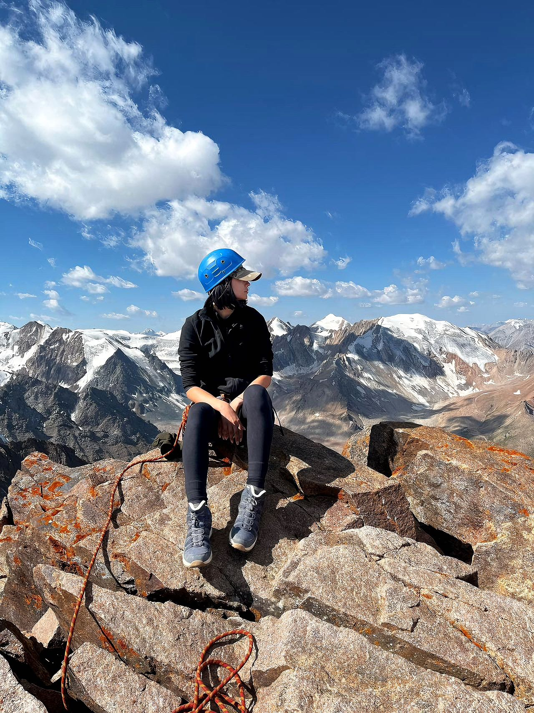

| 项目           | 信息                                                         |
| -------------- | ------------------------------------------------------------ |
| 编号           | Tang001                                                      |
| 姓名           | zhanna                                                       |
| 出生日期       | 2001年12月7日                                                |
| 年龄           | 23岁                                                         |
| 国籍           | 哈萨克斯坦                                                  |
| 现居住地       | 阿拉木图                                                     |
| 身高（厘米）   | 180                                                          |
| 体重（公斤）   | 58                                                           |
| 血型           | B                                                            |
| 教育程度       | 大学                                                         |
| 教育机构       | 哈萨克斯坦国立农业大学（兽医-护理专业） 新西伯利亚国立农业大学（兽医学院） |
| 自我介绍       | 我是一个积极向上的人，热爱动物和运动。我懂得承担责任，重视诚实和自律。我对医学和自然感兴趣，并致力于个人成长。 |
| 性格           | 善良、体贴、目标明确、在压力下保持冷静，能够保持纪律和自控力。 |
| 眼睛颜色       | 绿棕色                                                       |
| 头发颜色       | 深栗色                                                       |
| 是否喝酒       | 不                                                           |
| 是否吸烟       | 不                                                           |
| 上次月经第一天 | 4.16                                                         |
| 预计下次月经日期 | 5.27                                                        |
| 是否已婚       | 否                                                           |
| 先生同意捐卵吗 |                                                              |
| 是否处女       | 否                                                           |
| 可否住在公寓   | 我更喜欢住在酒店或有服务的公寓里。对我来说，舒适的康复条件和在项目期间的平静生活很重要。 |
| 有兄弟姐妹吗   | 是，2个姐姐，3个弟弟。                                       |
| 慢性疾病       | 否                                                           |
| 做过手术吗     | 否                                                           |
| 参加过捐精计划吗 | 是                                                          |
| 参加过多少次   | 1次                                                          |
| 会说哪些语言   | 俄语、初级英语                                               |
| 何时准备加入捐精计划 | 从下一个周期开始                                        |

