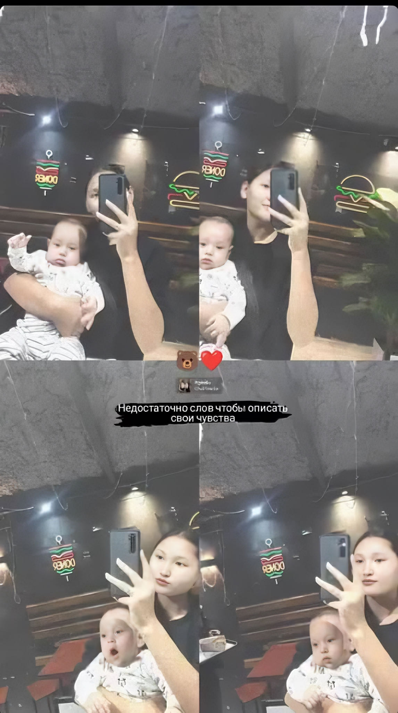

| 项目           | 信息                                                         |
| -------------- | ------------------------------------------------------------ |
| 编号           | Tang002                                                      |
| 姓名           | Aziza                                                        |
| 出生日期       | 2005年2月10日                                                |
| 年龄           | 20岁                                                         |
| 国籍           | 吉尔吉斯斯坦                                                  |
| 现居住地       | 比什凯克                                                     |
| 身高（厘米）   | 165                                                          |
| 体重（公斤）   | 50                                                           |
| 血型           | O型                                                          |
| 教育程度       | 大学                                                         |
| 教育机构       | 大学                                                         |
| 自我介绍       | 我目前热爱我的工作和运动。我热爱我的工作，并珍惜每天进步的机会。运动是我放松身心、补充能量和保持内心平衡的方式。 |
| 性格           |                                                              |
| 爱好           | 排球                                                         |
| 过敏原         | 灰尘                                                         |
| 眼睛颜色       | 棕色                                                         |
| 头发颜色       | 黑色                                                         |
| 是否喝酒       | 否                                                           |
| 是否吸烟       | 否                                                           |
| 上次月经第一天 | 4月30日                                                      |
| 预计下次月经日期 | 5月30日                                                     |
| 是否已婚       | 离婚                                                         |
| 先生同意捐卵吗 | 是                                                           |
| 是否处女       | 否                                                           |
| 可否住在公寓   | 是                                                           |
| 有兄弟姐妹吗   | 是                                                           |
| 慢性疾病       | 否                                                           |
| 做过手术吗     | 否                                                           |
| 参加过捐卵项目吗 | 是                                                          |
| 参加过多少次   |                                                              |
| 会说哪些语言   | 吉尔吉斯斯坦语 俄语                                          |
| 何时准备加入捐卵项目 | 现在                                                    |

[📹 观看视频：Tang002-3.mp4](/Tang002-3.mp4)
