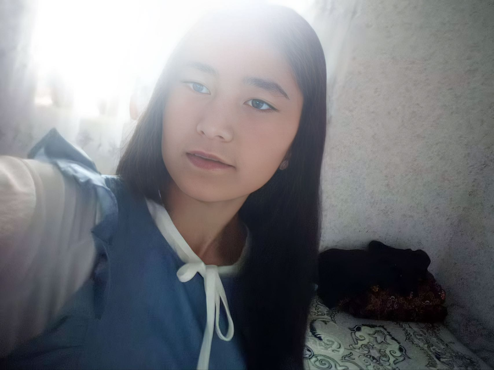

| 项目           | 信息                                                         |
| -------------- | ------------------------------------------------------------ |
| 编号           | Tang005                                                      |
| 姓名           | Yulduz                                                       |
| 出生日期       | 2007年09月28日                                               |
| 年龄           | 18岁                                                         |
| 国籍           | 乌兹别克斯坦                                                  |
| 现居住地       | Jizzax                                                       |
| 身高（厘米）   | 162                                                          |
| 体重（公斤）   | 50                                                           |
| 血型           | 0+                                                           |
| 教育程度       | 中学                                                         |
| 自我介绍       | 善良                                                         |
| 性格           | 安静                                                         |
| 婚姻状况       | 离婚                                                         |
| 过敏           | 无过敏                                                       |
| 眼睛颜色       | 黑色眼睛                                                     |
| 头发颜色       | 黑色                                                         |
| 是否喝酒       | 不                                                           |
| 是否吸烟       | 不                                                           |
| 上次月经第一天 | 2025年4月22日                                                |
| 预计下次月经日期 | 2025年5月22日                                               |
| 有兄弟姐妹吗   | 有3个                                                        |
| 慢性疾病       | 没有                                                         |
| 做过手术吗     | 一年前做过阑尾炎切除手术                                     |
| 参加过慈善项目吗 | 第一次参加                                                  |
| 会说哪些语言   | 乌语                                                         |
| 何时准备加入慈善计划 | 已经准备好                                              |

