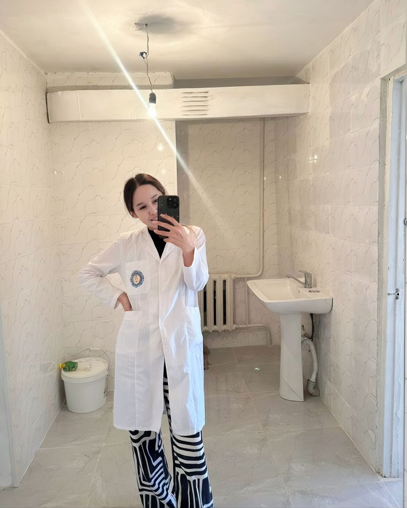
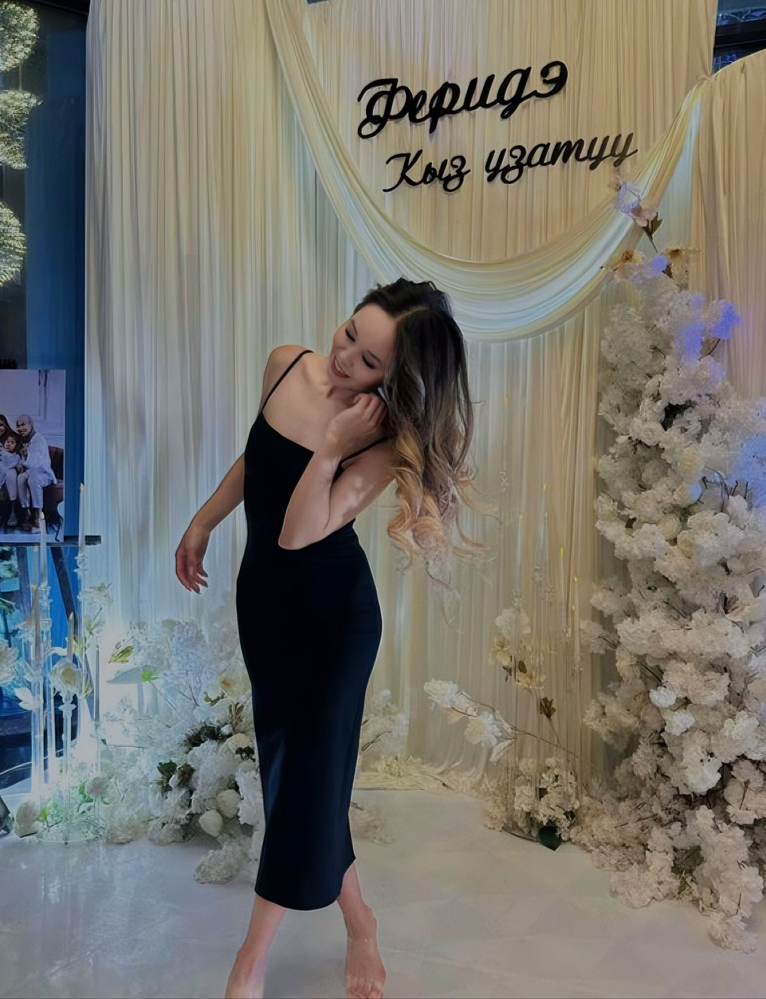
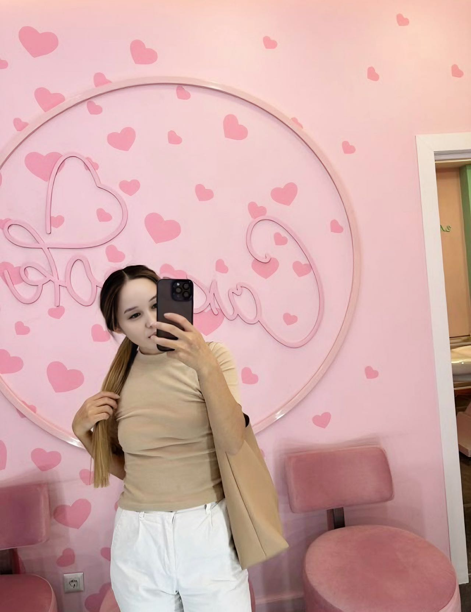

| 项目           | 信息                                                         |
| -------------- | ------------------------------------------------------------ |
| 编号           | Tang006                                                      |
| 姓名           | 爱达伊                                                       |
| 出生日期       | 1996年7月10日                                                |
| 年龄           | 28岁                                                         |
| 国籍           | 吉尔吉斯斯坦                                                  |
| 现居住地       | 比什凯克市                                                   |
| 身高（厘米）   | 164                                                          |
| 体重（公斤）   | 53                                                           |
| 血型           | A+                                                           |
| 教育程度       | 大学                                                         |
| 教育机构       | BMK                                                          |
| 自我介绍       | 积极，爱动物，同情心。负责任，领导力，创造力                 |
| 性格           | 冷静                                                         |
| 爱好           | 绘画、马赛克、瑜伽、散步                                     |
| 过敏           | 无                                                           |
| 眼睛颜色       | 深绿色                                                       |
| 头发颜色       | 深棕色                                                       |
| 是否喝酒       | 很少                                                         |
| 是否吸烟       | 没有                                                         |
| 上次月经第一天 | 2025年6月11日                                                |
| 预计下次月经日期 | 2025年7月10日至12日                                         |
| 是否已婚       | 没有                                                         |
| 先生同意捐卵吗 |                                                              |
| 是否处女       | 不                                                           |
| 可否住在公寓   | 可能                                                         |
| 有兄弟姐妹吗   | 是的（哥哥，姐姐，妹妹）                                     |
| 慢性疾病       | 没有                                                         |
| 做过手术吗     | 没有                                                         |
| 参加过捐赠计划吗 | 没有                                                        |
| 会说哪些语言   | 俄语、吉尔吉斯语和一些英语                                   |
| 何时准备加入捐赠计划 | 在任何时候                                              |

