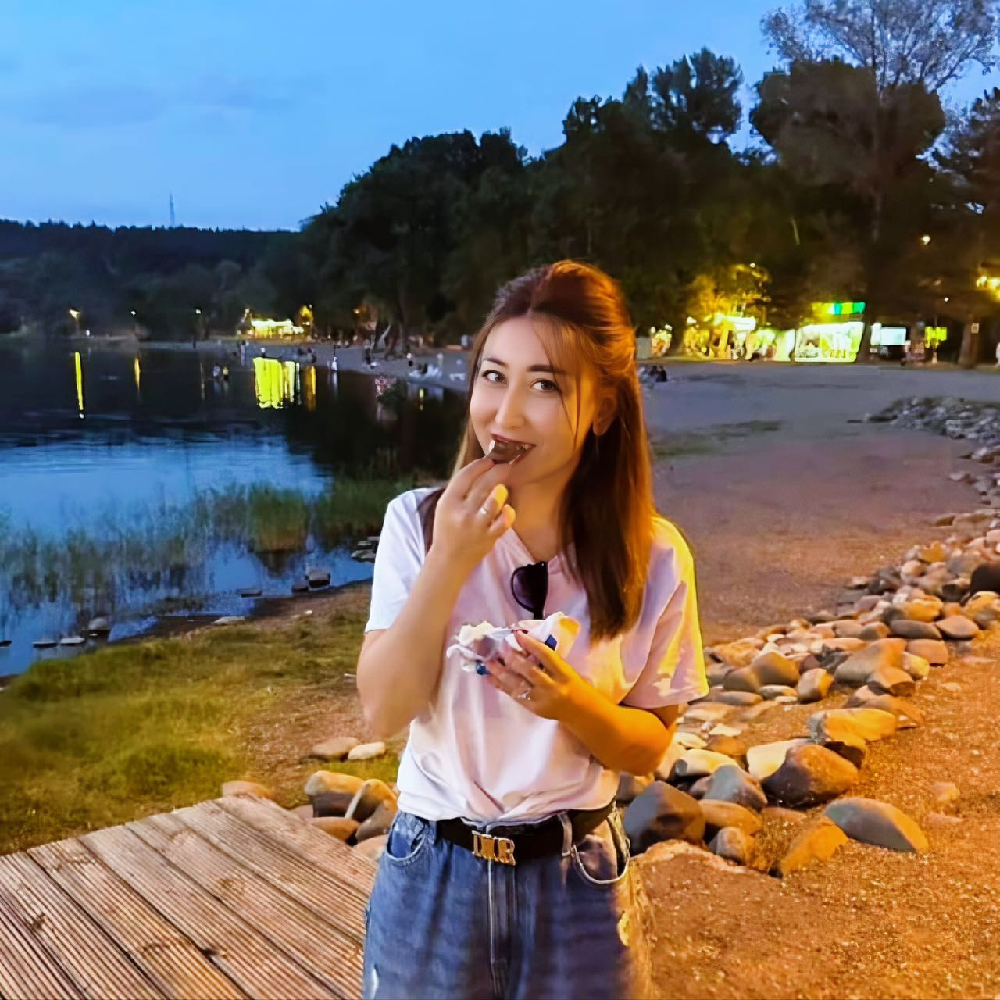
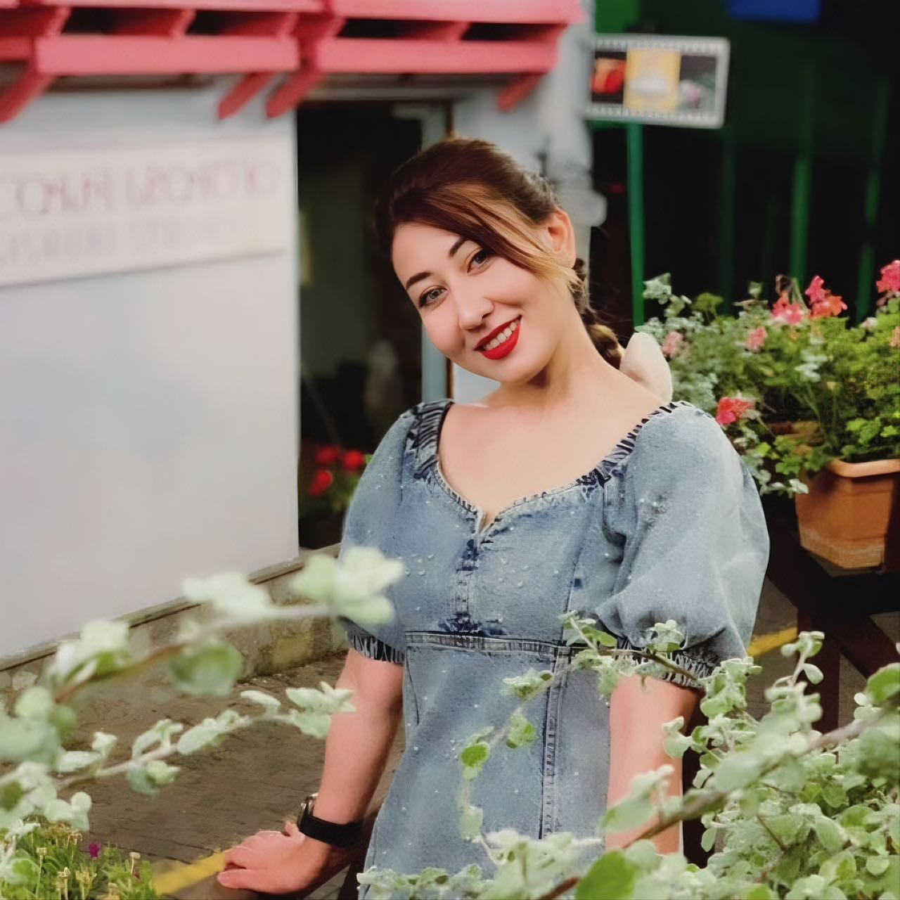
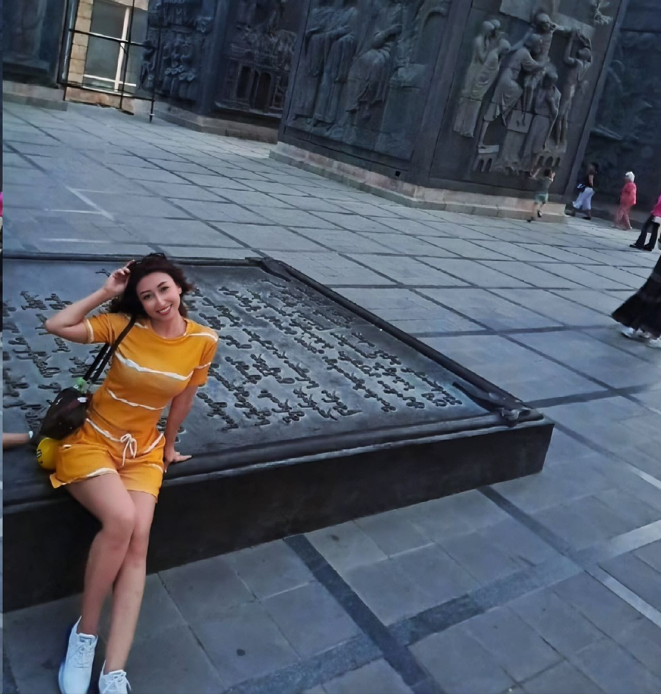
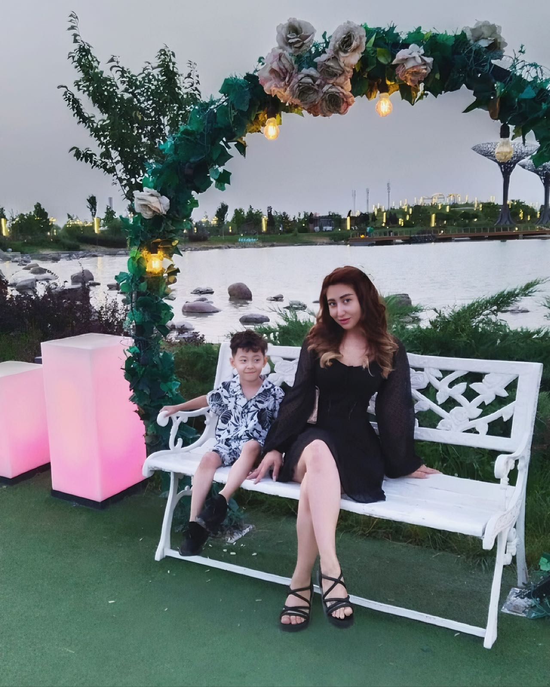

| 项目           | 信息                                                         |
| -------------- | ------------------------------------------------------------ |
| 编号           | Tang007                                                      |
| 姓名           | 纳西莫娃·巴尔奇娜                                            |
| 出生日期       | 1999年1月11日                                                |
| 年龄           | 26岁                                                         |
| 国籍           | 乌兹别克斯坦                                                  |
| 现居住地       | 乌兹别克斯坦                                                 |
| 身高（厘米）   | 163                                                          |
| 体重（公斤）   | 55                                                           |
| 血型           | O+                                                           |
| 教育程度       | 大学                                                         |
| 教育机构       | 11年级                                                       |
| 自我介绍       | 我会说5种语言，我喜欢旅行，我喜欢烹饪和学习新文化。          |
| 性格           | 我从小就独立，不喜欢依赖任何人，我总是有自己的选择和决定。   |
| 爱好           | 做饭和画画                                                   |
| 过敏           | 无                                                           |
| 眼睛颜色       | 棕色                                                         |
| 头发颜色       | 棕色                                                         |
| 是否喝酒       | 没有                                                         |
| 是否吸烟       | 没有                                                         |
| 上次月经第一天 | 2025年6月6日                                                 |
| 预计下次月经日期 | 2025年7月3日                                                |
| 是否已婚       | 不，我没有结婚                                               |
| 是否处女       | 没有                                                         |
| 可否住在公寓   | 可以的                                                       |
| 有兄弟姐妹吗   | 我有一个弟弟和一个妹妹                                       |
| 慢性疾病       | 没有                                                         |
| 做过手术吗     | 剖腹产                                                       |
| 参加过捐赠计划吗 | 没有                                                        |
| 会说哪些语言   | 我会说俄语，乌兹别克语，塔吉克语，土耳其语，阿塞拜疆语，哈萨克语 |
| 何时准备加入捐赠计划 | 现在                                                    |

[📹 观看视频：Tang007-6.mp4](/Tang007-6.mp4)
