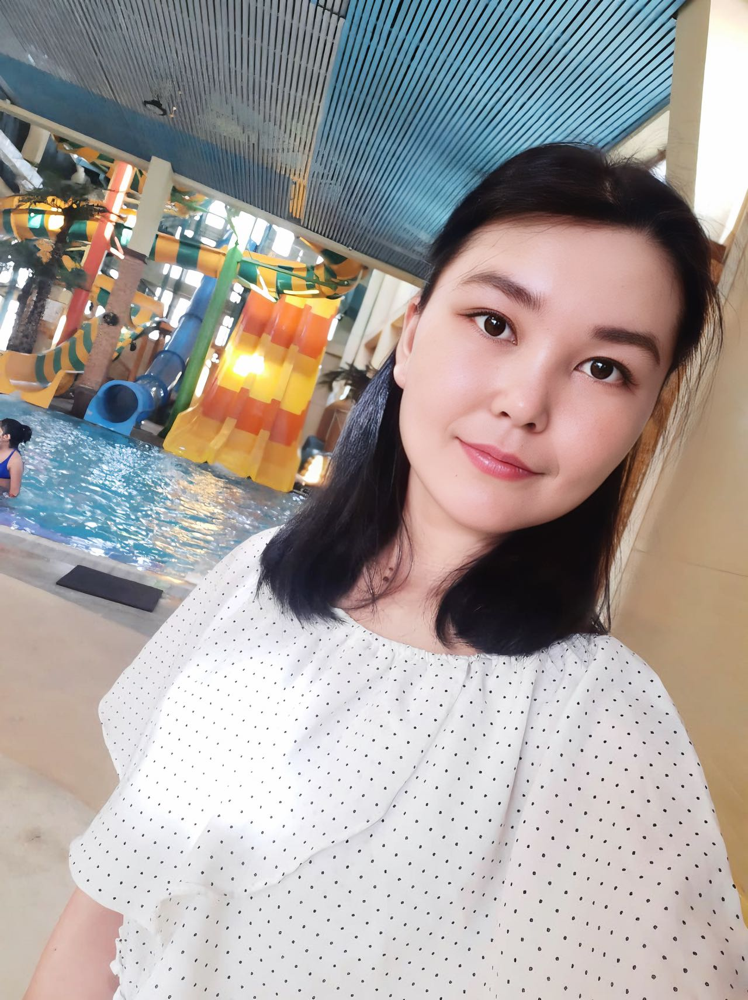
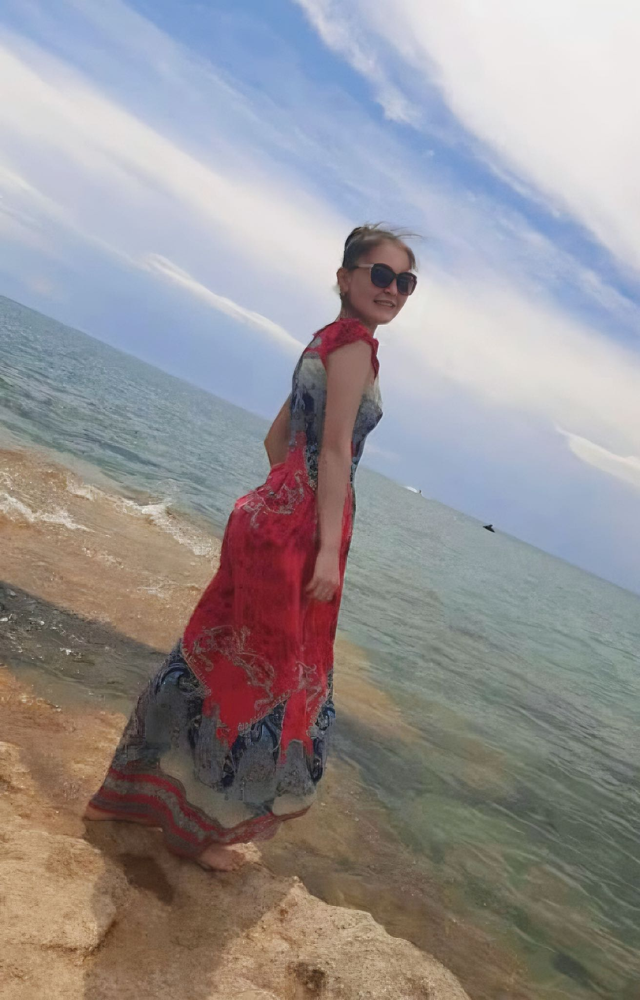

| 项目           | 信息                                                         |
| -------------- | ------------------------------------------------------------ |
| 编号           | Tang008                                                      |
| 姓名           | 坦苏卢                                                       |
| 出生日期       | 2001年3月16日                                                |
| 年龄           | 24岁                                                         |
| 国籍           | 吉尔吉斯斯坦                                                  |
| 现居住地       | 比什凯克                                                     |
| 身高（厘米）   | 166                                                          |
| 体重（公斤）   | 57                                                           |
| 血型           | A                                                            |
| 教育程度       | 大专                                                         |
| 教育机构       | 11年级                                                       |
| 自我介绍       |                                                              |
| 性格           | 善良、安静、无不良嗜好                                       |
| 爱好           | 烹饪                                                         |
| 过敏           | 无                                                           |
| 眼睛颜色       | 棕色                                                         |
| 头发颜色       | 黑色                                                         |
| 是否喝酒       | 没有                                                         |
| 是否吸烟       | 没有                                                         |
| 上次月经第一天 | 2025年5月22日                                                |
| 预计下次月经日期 | 大约6月25日                                                 |
| 是否已婚       | 是                                                           |
| 先生同意捐卵吗 | 是的                                                         |
| 是否处女       | 没有                                                         |
| 可否住在公寓   | 没有                                                         |
| 有兄弟姐妹吗   | 兄弟，姐姐和我                                               |
| 慢性疾病       | 没有                                                         |
| 做过手术吗     | 没有                                                         |
| 参加过捐赠计划吗 | 没有                                                        |
| 参加过多少次   | 第一个                                                       |
| 会说哪些语言   | 俄语，吉尔吉斯语                                             |
| 何时准备加入捐赠计划 | 随时                                                    |

