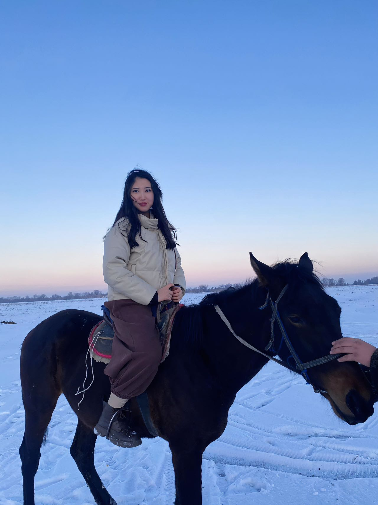

| 项目           | 信息                                                         |
| -------------- | ------------------------------------------------------------ |
| 编号           | Tang010                                                      |
| 姓名           | Zhanara                                                      |
| 出生日期       | 2004年9月24日                                                |
| 年龄           | 20岁                                                         |
| 国籍           | 吉尔吉斯斯坦                                                  |
| 现居住地       | 卡拉巴尔塔州楚伊                                             |
| 身高（厘米）   | 172                                                          |
| 体重（公斤）   | 59                                                           |
| 血型           | B+                                                           |
| 教育程度       | 大专                                                         |
| 教育机构       | 皮罗戈夫                                                     |
| 自我介绍       | 我今年岁，正在学习药剂学专业。我拥有健康的生活方式。平衡、负责、无不良习惯。我认真对待自己的责任，并谨慎对待健康问题。我之前已经接受过捐献项目 - 一切顺利。我愿意帮助那些渴望再次拥有孩子的人。 |
| 性格           | 善良、富有同情心、性格冷静，善于倾听和理解他人。我努力在任何情况下都保持积极的态度。 |
| 爱好           | 我喜欢阅读，喜欢小说和关于自我提升的书籍。空闲时间我会画画、做普拉提来保持健康和内心的平衡。 |
| 过敏           | 否                                                           |
| 眼睛颜色       | 深棕色                                                       |
| 头发颜色       | 深棕色                                                       |
| 是否喝酒       | 否                                                           |
| 是否吸烟       | 否                                                           |
| 上次月经第一天 | 05.20                                                        |
| 预计下次月经日期 | 06.20                                                       |
| 是否已婚       | 否                                                           |
| 先生同意捐卵吗 |                                                              |
| 是否处女       | 否                                                           |
| 可否住在公寓   | 可以，但我待在家里会很舒服                                   |
| 有兄弟姐妹吗   | 是                                                           |
| 慢性疾病       | 否                                                           |
| 做过手术吗     | 是                                                           |
| 参加过捐卵项目吗 | 是                                                          |
| 参加过多少次   | 1次                                                          |
| 会说哪些语言   | 吉尔吉斯语、俄语、哈萨克语、土耳其语                         |
| 何时准备加入捐卵项目 | 本月底                                                  |

[📹 观看视频：Tang010-5.mp4](/Tang010-5.mp4)
