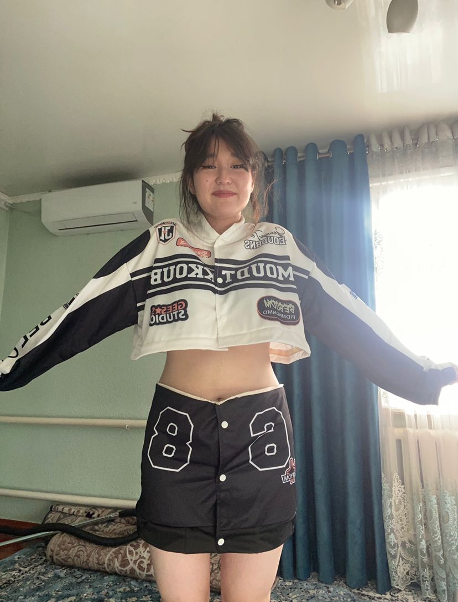
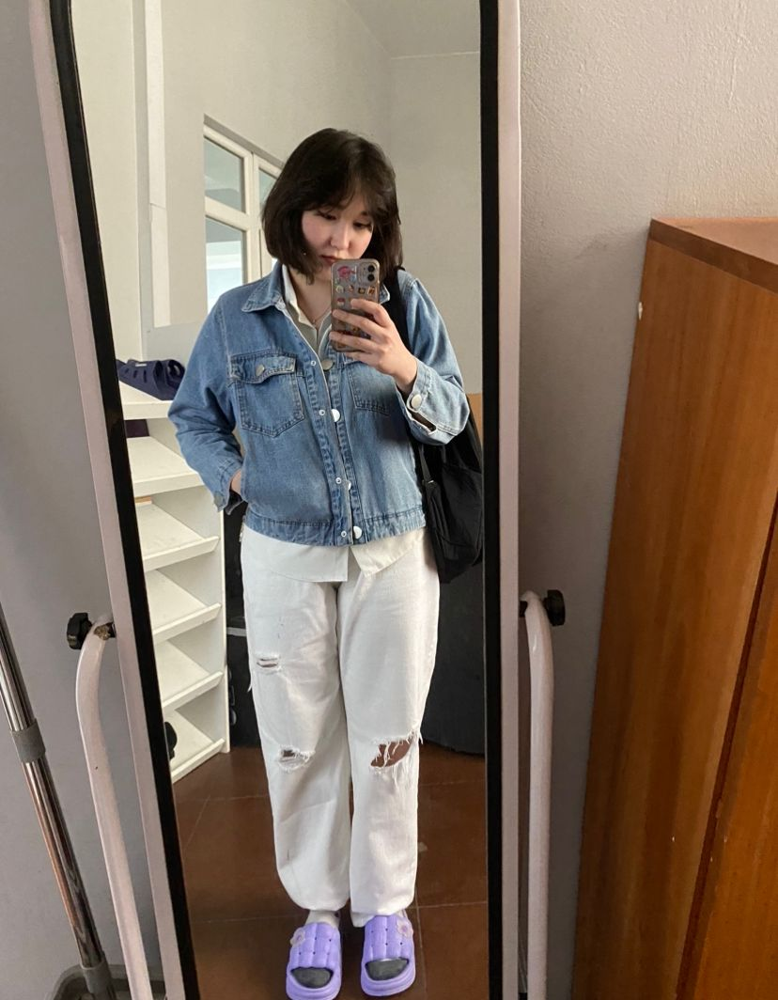
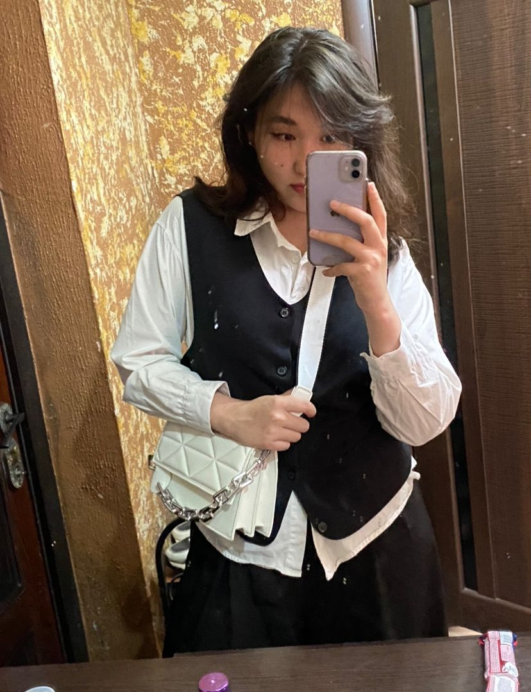
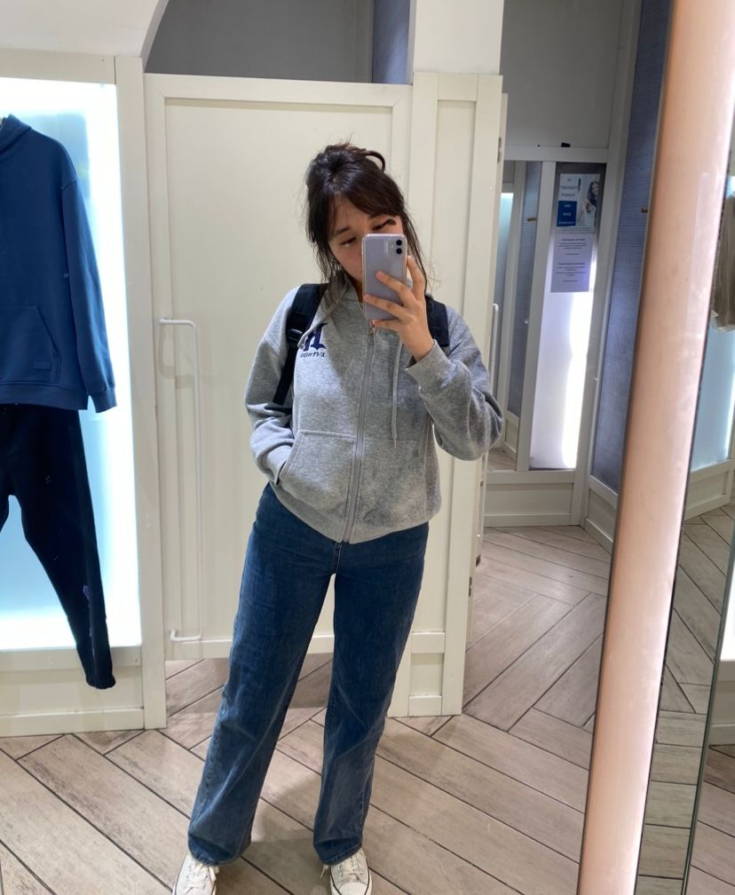

| 项目           | 信息                                                         |
| -------------- | ------------------------------------------------------------ |
| 编号           | Tang011                                                      |
| 姓名           | Kanykey                                                      |
| 出生日期       | 2005年11月14日                                               |
| 年龄           | 19岁                                                         |
| 国籍           | 吉尔吉斯斯坦                                                  |
| 现居住地       | 比什凯克                                                     |
| 身高（厘米）   | 176                                                          |
| 体重（公斤）   | 63                                                           |
| 血型           | O                                                            |
| 教育程度       | 高等教育，目前函授学习                                       |
| 教育机构       | PSOSH                                                        |
| 自我介绍       | 关于我自己，我可以说我是一个诚实的人，我不能忍受谎言。我还可以补充一点，我是一个富有创造力和创造力的人，我知道如何表达自己的想法，并且通常会为问题提供好的建议或解决方案，我有一个TikTok帐户，我可以在里面分享我的想法，总的来说，我会分享我生活中的点点滴滴。我不喜欢所有流行的东西，尤其是衣服，我喜欢独特的东西，我试着穿符合我性格和风格的衣服。 |
| 性格           | 平衡、不爱争吵、性格冷静、性情温和、富有同情心、同理心强、脆弱敏感。 |
| 爱好           | 科学方面是历史、心理学，我还擅长绘画、视频编辑，我能用宝石和珍珠制作漂亮的珠宝，我烹饪得非常美味，我还擅长剪头发、做不同的发型。最近我开始对物理和几何感兴趣。我喜欢把衣服打扮得漂漂亮亮，化妆。 |
| 过敏           | 对任何东西都不过敏                                           |
| 眼睛颜色       | 深棕色                                                       |
| 头发颜色       | 棕色，栗色                                                   |
| 是否喝酒       | 不                                                           |
| 是否吸烟       | 不                                                           |
| 上次月经第一天 | 我不记得我上次月经的第一天                                   |
| 预计下次月经日期 | 5.16                                                        |
| 有兄弟姐妹吗   | 是的，有两个哥哥和一个姐姐                                   |
| 慢性疾病       | 我没有                                                       |
| 做过手术吗     | 没有                                                         |
| 参加过捐献计划吗 | 2025-1, 比什凯克                                           |
| 会说哪些语言   | 俄语、吉尔吉斯语，我正在学英语                               |
| 现在在哪个城市和国家 | 比什凯克                                              |
| 何时准备加入捐赠计划 | 我明天就准备好了                                        |

[📹 观看视频：Tang011-9.mp4](/Tang011-9.mp4)
