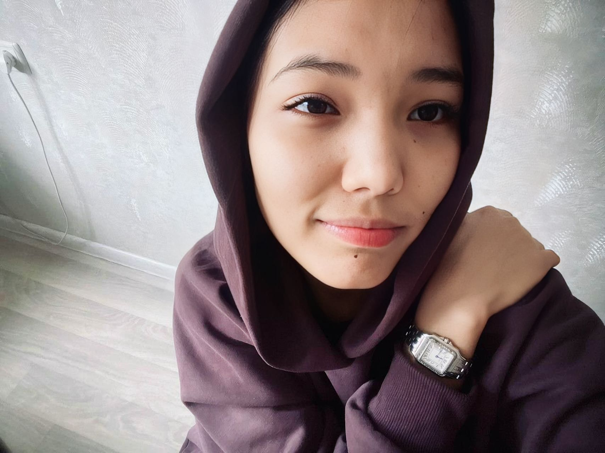
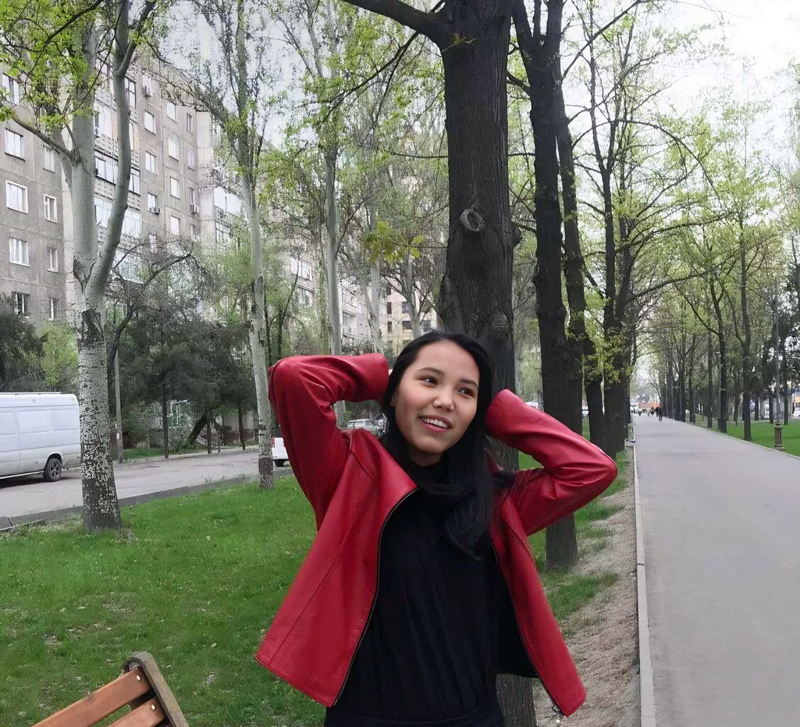

| 项目           | 信息                                                         |
| -------------- | ------------------------------------------------------------ |
| 编号           | Tang013                                                      |
| 姓名           | 阿亚娜                                                       |
| 出生日期       | 02.08.2004                                                   |
| 年龄           | 20                                                           |
| 民族           | 吉尔吉斯人                                                   |
| 现居住地       | 比什凯克市上贾尔街3/5                                        |
| 身高（厘米）   | 170                                                          |
| 体重（公斤）   | 49                                                           |
| 血型           | B                                                            |
| 教育程度       | 大专                                                         |
| 教育机构       | 12个体育馆                                                   |
| 职业           | 现在我是一名足球教练，和父母住在一起。                       |
| 性格           | 温和，有时很难相处                                           |
| 爱好           | 写诗、运动、喜欢音乐                                         |
| 过敏           | 对酒精过敏                                                   |
| 眼睛颜色       | 棕色                                                         |
| 头发颜色       | 黑色                                                         |
| 是否喝酒       | 已经一年没喝了                                               |
| 是否吸烟       | 不抽烟                                                       |
| 上次月经第一天 | 我真的不记得了                                               |
| 是否已婚       | 没有                                                         |
| 先生同意捐卵吗 |                                                              |
| 有兄弟姐妹吗   | 姐姐和妹妹                                                   |
| 慢性疾病       | 没有                                                         |
| 做过手术吗     | 没有                                                         |
| 参加过捐赠计划吗 | 没有                                                        |
| 会说哪些语言   | 俄语，吉尔吉斯语，正在学习英语                               |
| 何时准备加入捐款计划 | 下周开始                                                |

[📹 观看视频：Tang013-5.mp4](/Tang013-5.mp4)
