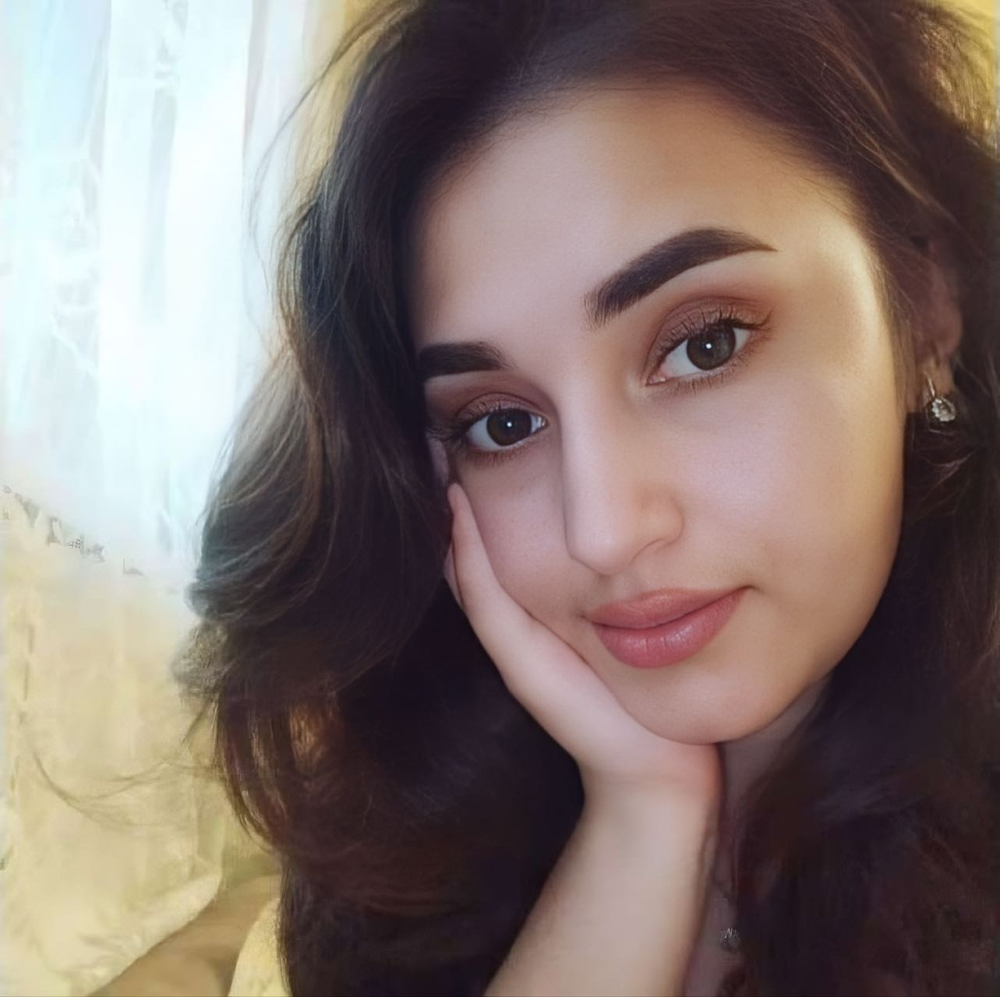
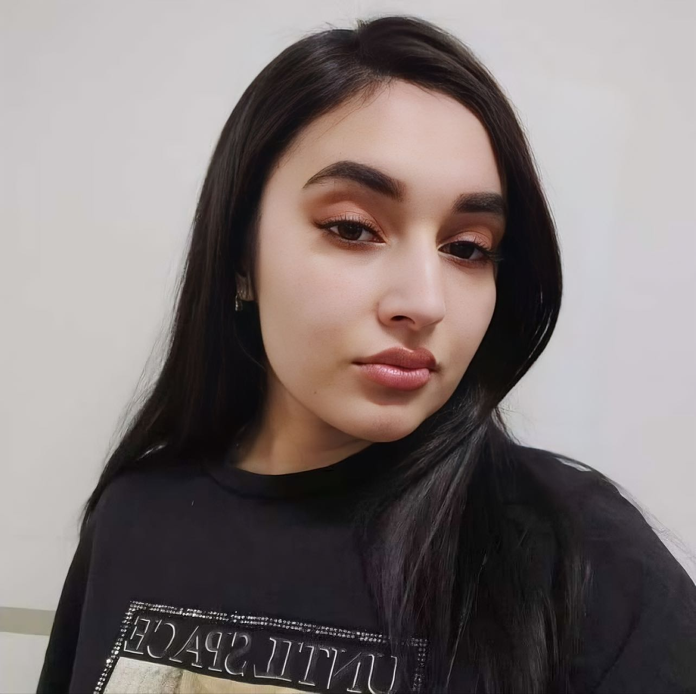
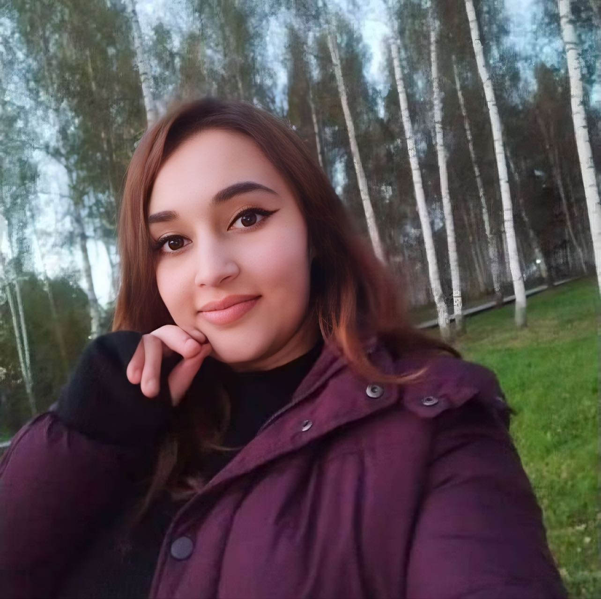
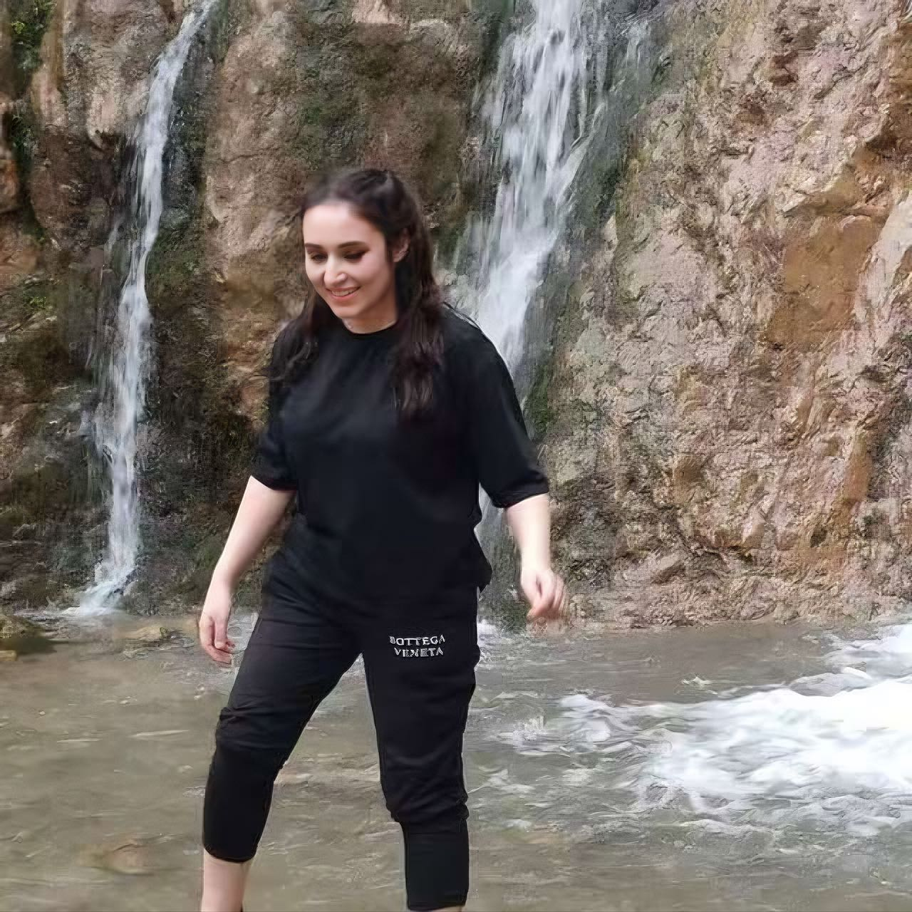
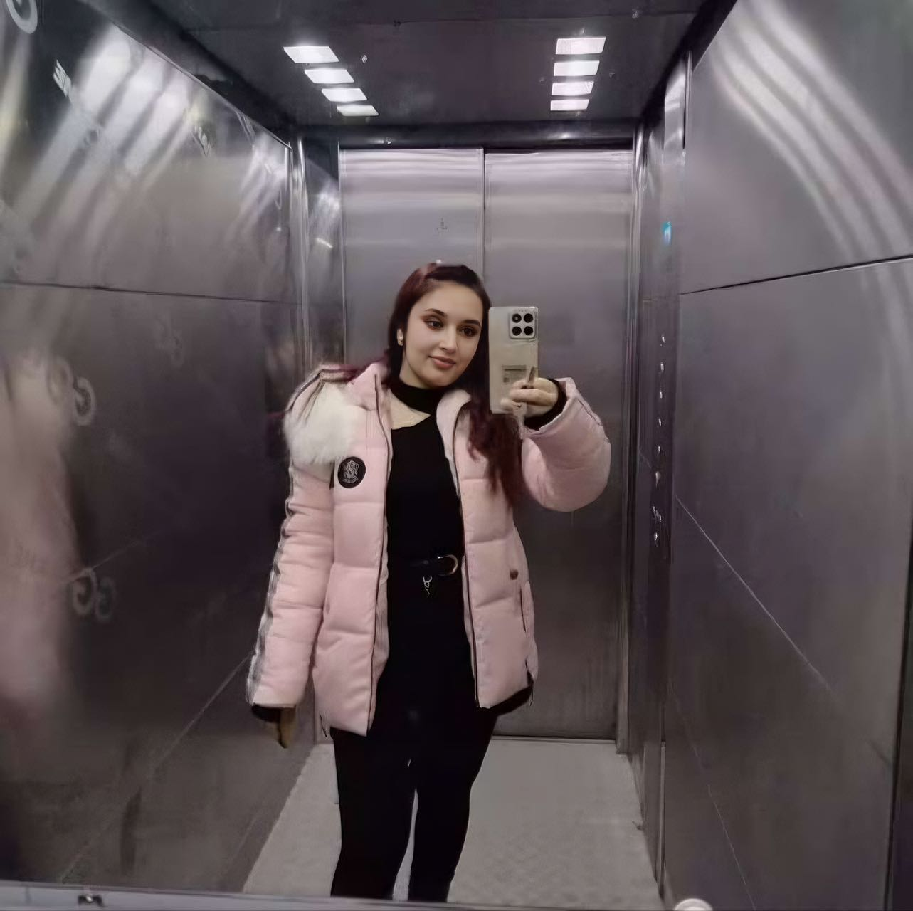

| 项目           | 信息                                                         |
| -------------- | ------------------------------------------------------------ |
| 编号           | Tang014                                                      |
| 姓名           | 卡莫拉                                                       |
| 出生日期       | 2003年04月27日                                               |
| 年龄           | 22                                                           |
| 国籍           | 乌兹别克斯坦                                                 |
| 现居住地       | Samarkand                                                    |
| 身高（厘米）   | 165                                                          |
| 体重（公斤）   | 63                                                           |
| 血型           | AB+                                                          |
| 教育程度       | 大学                                                         |
| 教育机构       |                                                              |
| 自我介绍       | 阿塞拜疆名族                                                 |
| 性格           | 善良，开心                                                   |
| 爱好           | 没有                                                         |
| 过敏           | 没有                                                         |
| 眼睛颜色       | 深棕色                                                       |
| 头发颜色       | 棕色                                                         |
| 是否喝酒       | 不喝                                                         |
| 是否吸烟       | 不抽烟                                                       |
| 上次月经第一天 | 5月25日                                                      |
| 预计下次月经日期 | 6月25日                                                     |
| 是否已婚       | 已婚                                                         |
| 先生同意捐卵吗 | 当然                                                         |
| 是否处女       | 没有                                                         |
| 可否住在公寓   | 商量                                                         |
| 有兄弟姐妹吗   | 有                                                           |
| 慢性疾病       | 否                                                           |
| 做过手术吗     | 2011年做阑尾炎                                               |
| 参加过捐赠计划吗 | 否                                                          |
| 参加过多少次   | 否                                                           |
| 会说哪些语言   | 乌语，俄语，塔吉克语和土耳其语，阿塞拜疆语                   |
| 何时准备加入捐款计划 | 2025年6月以后                                          |

[📹 观看视频：Tang014-6.mp4](/Tang014-6.mp4)