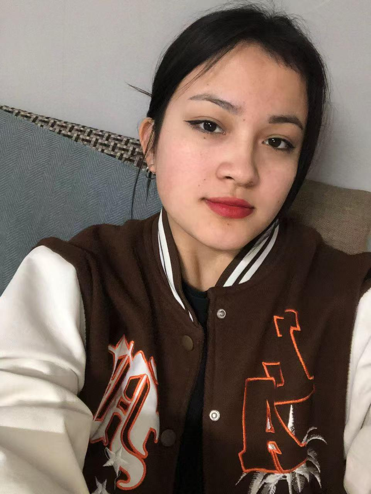
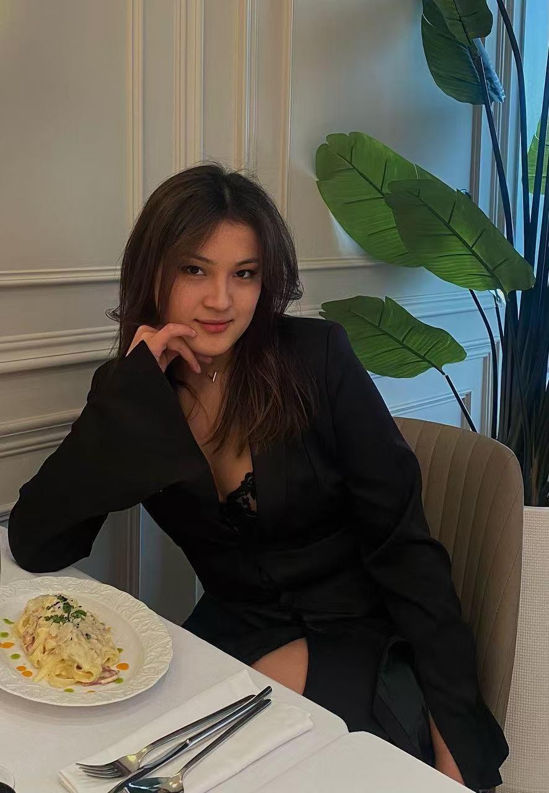
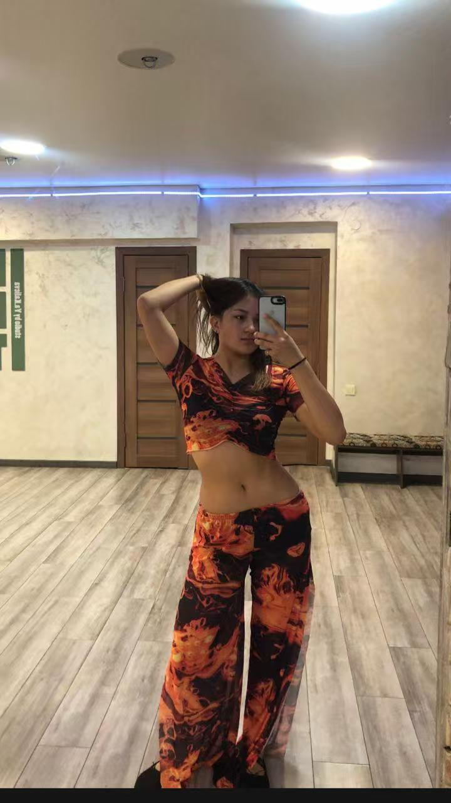

| 项目           | 信息                                                         |
| -------------- | ------------------------------------------------------------ |
| 编号           | Tang015                                                      |
| 姓名           | 乌松·克孜·阿克贝梅特                                         |
| 出生日期       | 2004.06.29                                                   |
| 年龄           | 20                                                           |
| 民族           | 吉尔吉斯人+突厥人                                            |
| 国籍           | 吉尔吉斯斯坦                                                 |
| 现居住地       | 奥什                                                         |
| 身高（厘米）   | 165                                                          |
| 体重（公斤）   | 63                                                           |
| 血型           | B+                                                           |
| 教育程度       | 中等                                                         |
| 教育机构       |                                                              |
| 自我介绍       |                                                              |
| 性格           |                                                              |
| 爱好           |                                                              |
| 过敏           |                                                              |
| 眼睛颜色       | 棕色                                                         |
| 头发颜色       | 黑色                                                         |
| 是否喝酒       |                                                              |
| 是否吸烟       |                                                              |
| 上次月经第一天 | 6月5日                                                       |
| 预计下次月经日期 |                                                             |
| 是否已婚       |                                                              |
| 先生同意捐卵吗 |                                                              |
| 是否处女       |                                                              |
| 可否住在公寓   |                                                              |
| 有兄弟姐妹吗   |                                                              |
| 慢性疾病       | 没有                                                         |
| 做过手术吗     |                                                              |
| 参加过捐赠计划吗 | 没有                                                        |
| 参加过多少次   |                                                              |
| 会说哪些语言   |                                                              |
| 何时准备加入捐款计划 |                                                         |
| 身体状态       | 运动型93胸围，77腰围，94厘米臀围                             |
| 有孩子吗       | 没有                                                         |
| 目前是否正在服用药物 | 没有                                                   |
| 是否有不良习惯 | 没有                                                         |
| 是否有皮肤和性病或精神病 | 没有                                               |
| 是否有传染病   | 没有                                                         |

[📹 观看视频：Tang015-4.mp4](/Tang015-4.mp4)
[📹 观看视频：Tang015-5.mp4](/Tang015-5.mp4)