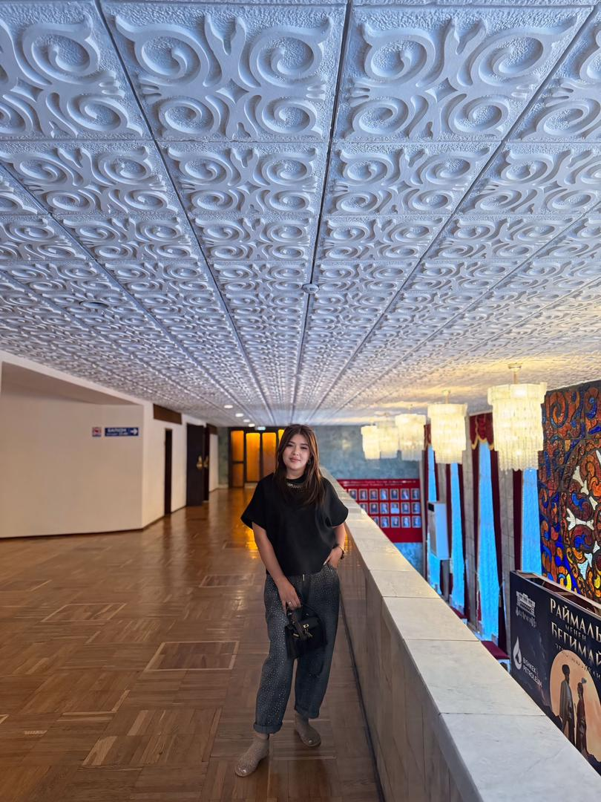

| 项目           | 信息                                                         |
| -------------- | ------------------------------------------------------------ |
| 编号           | Tang016                                                      |
| 姓名           | Meerim                                                       |
| 出生日期       | 1998年10月23日                                               |
| 年龄           | 26岁                                                         |
| 国籍           | 吉尔吉斯斯坦                                                 |
| 现居住地       | 比什凯克                                                     |
| 身高（厘米）   | 165                                                          |
| 体重（公斤）   | 70                                                           |
| 血型           | B型                                                          |
| 教育程度       | 大专                                                         |
| 教育机构       |                                                              |
| 自我介绍       | 我的职业是编舞                                               |
| 性格           | 骄傲                                                         |
| 爱好           | 舞蹈                                                         |
| 过敏           | 无                                                           |
| 眼睛颜色       | 棕色                                                         |
| 头发颜色       | 黑色                                                         |
| 是否喝酒       | 不                                                           |
| 是否吸烟       | 不                                                           |
| 上次月经第一天 | 6月3日                                                       |
| 预计下次月经日期 | 6月30日                                                     |
| 是否已婚       | 是                                                           |
| 先生同意捐卵吗 | 是                                                           |
| 是否处女       | 否                                                           |
| 可否住在公寓   | 否                                                           |
| 有兄弟姐妹吗   | 否                                                           |
| 慢性疾病       | 否                                                           |
| 做过手术吗     | 否                                                           |
| 参加过捐赠计划吗 | 没有，是第一次                                              |
| 参加过多少次   | 从未尝试过                                                   |
| 会说哪些语言   | 俄语 吉尔吉斯语                                              |
| 何时准备加入捐款计划 | 今天                                                    |

[📹 观看视频：Tang016-6.mp4](/Tang016-6.mp4)