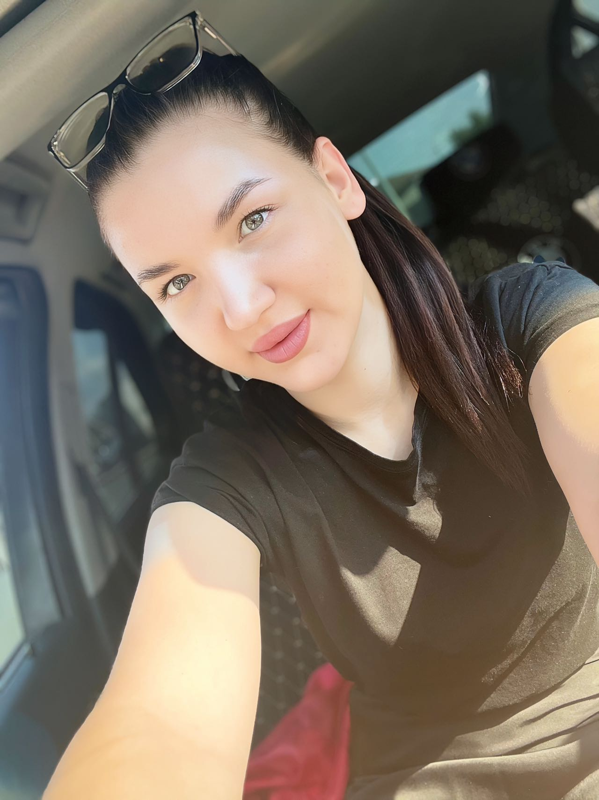
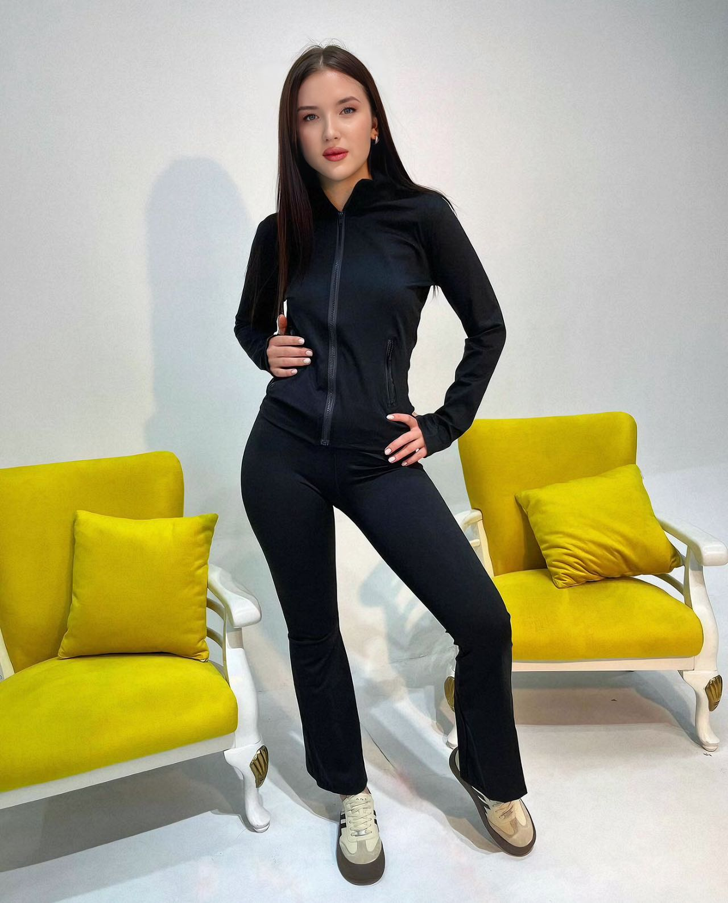
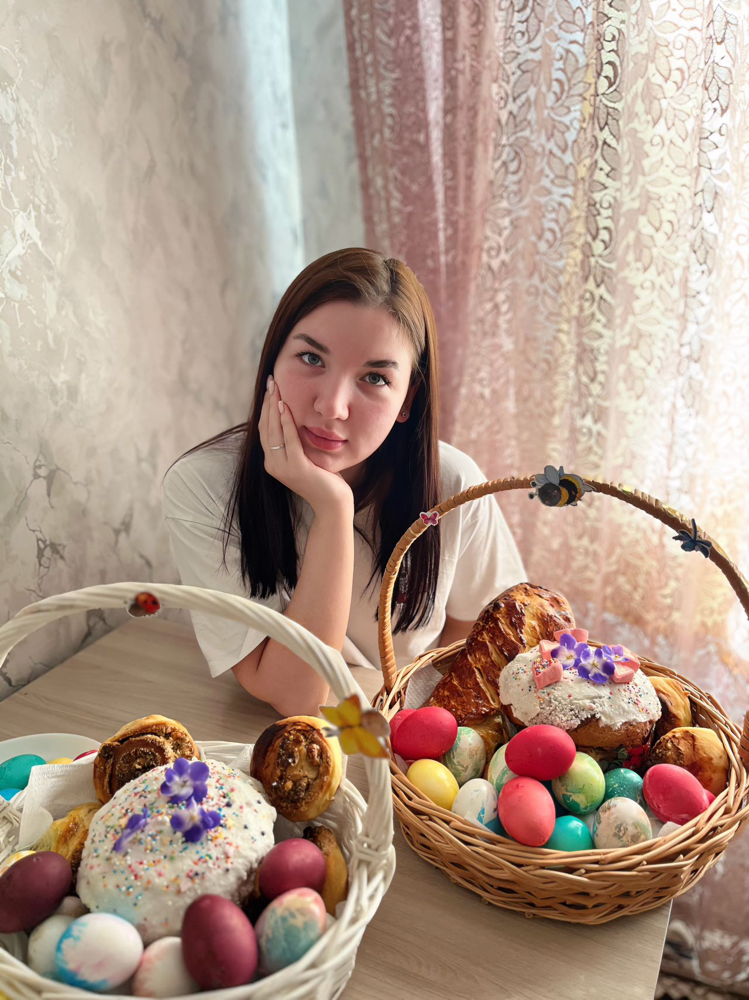

| 项目           | 信息                                                         |
| -------------- | ------------------------------------------------------------ |
| 编号           | Tang017                                                      |
| 姓名           | 维多利亚                                                     |
| 出生日期       | 2002年3月3日                                                 |
| 年龄           | 23                                                           |
| 国籍           | 哈萨克斯坦                                                   |
| 现居住地       | 奇姆肯特                                                     |
| 身高（厘米）   | 175                                                          |
| 体重（公斤）   | 63                                                           |
| 血型           | A+                                                           |
| 教育程度       | 大专                                                         |
| 教育机构       | 11年级                                                       |
| 自我介绍       | 善良，固执                                                   |
| 性格           | 不惜一切代价达成目标                                         |
| 爱好           | 跳舞、阅读                                                   |
| 过敏           | 无                                                           |
| 眼睛颜色       | 绿色                                                         |
| 头发颜色       | 浅棕色                                                       |
| 是否喝酒       | 没有                                                         |
| 是否吸烟       | 没有                                                         |
| 上次月经第一天 | 2025年6月1日                                                 |
| 预计下次月经日期 | 2025年7月1日                                                |
| 是否已婚       | 没有                                                         |
| 先生同意捐卵吗 | 没有丈夫                                                     |
| 是否处女       | 没有                                                         |
| 可否住在公寓   | 是的                                                         |
| 有兄弟姐妹吗   | 是的                                                         |
| 慢性疾病       | 无                                                           |
| 做过手术吗     | 没有                                                         |
| 参加过捐赠计划吗 | 是的，上一次2024年11月，所有检查报告，医院都没给            |
| 参加过多少次   | 2次                                                          |
| 会说哪些语言   | 俄语                                                         |
| 何时准备加入捐款计划 | 到2025年7月1日                                          |

