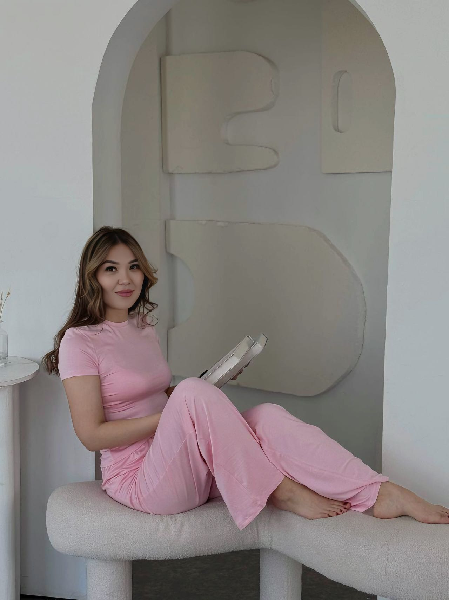

| 项目           | 信息                                                         |
| -------------- | ------------------------------------------------------------ |
| 编号           | Tang019                                                      |
| 姓名           | Aidana                                                       |
| 出生日期       | 1999年2月13日                                                |
| 年龄           | 26岁                                                         |
| 国籍           | 吉尔吉斯斯坦                                                 |
| 现居住地       | 比什凯克                                                     |
| 身高（厘米）   | 163                                                          |
| 体重（公斤）   | 58                                                           |
| 血型           | B+                                                           |
| 教育程度       | 大学                                                         |
| 教育机构       | 医学院                                                       |
| 自我介绍       | 我有一个3岁的儿子                                            |
| 性格           | 冷静                                                         |
| 爱好           | 运动                                                         |
| 过敏           | 无                                                           |
| 眼睛颜色       | 棕色                                                         |
| 头发颜色       | 棕色                                                         |
| 是否喝酒       | 不                                                           |
| 是否吸烟       | 不                                                           |
| 上次月经第一天 | 6月1日                                                       |
| 预计下次月经日期 | 7月1日                                                      |
| 是否已婚       | 否                                                           |
| 先生同意捐卵吗 |                                                              |
| 是否处女       | 否                                                           |
| 可否住在公寓   | 是                                                           |
| 有兄弟姐妹吗   | 3个兄弟，1个姐妹                                             |
| 慢性疾病       | nrt                                                          |
| 做过手术吗     | 否                                                           |
| 参加过捐赠计划吗 | 否                                                          |
| 参加过多少次   |                                                              |
| 会说哪些语言   | 俄语，吉尔吉斯语                                             |
| 何时准备加入捐款计划 | 随时                                                    |

[📹 观看视频：Tang019-4.mp4](/Tang019-4.mp4)
[📹 观看视频：Tang019-5.mp4](/Tang019-5.mp4)