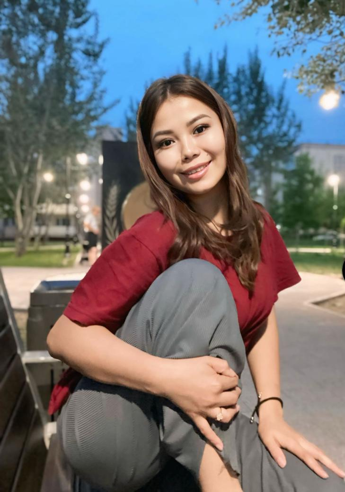

| 项目           | 信息                                                         |
| -------------- | ------------------------------------------------------------ |
| 编号           | Tang022                                                      |
| 姓名           | Egemberdi Aitolkyn                                           |
| 出生日期       | 29.09.1998                                                   |
| 年龄           | 26                                                           |
| 国籍           | 哈萨克斯坦                                                   |
| 现居住地       | 阿拉木图                                                     |
| 身高（厘米）   | 1.65                                                         |
| 体重（公斤）   | 65公斤                                                       |
| 血型           | 1 阳性                                                       |
| 教育程度       | 中专                                                         |
| 教育机构       |                                                              |
| 自我介绍       |                                                              |
| 性格           |                                                              |
| 爱好           |                                                              |
| 过敏           |                                                              |
| 眼睛颜色       | 棕色                                                         |
| 头发颜色       | 黑色                                                         |
| 是否喝酒       |                                                              |
| 是否吸烟       |                                                              |
| 上次月经第一天 | 13六月                                                       |
| 预计下次月经日期 |                                                             |
| 是否已婚       |                                                              |
| 先生同意捐卵吗 |                                                              |
| 是否处女       |                                                              |
| 可否住在公寓   |                                                              |
| 有兄弟姐妹吗   |                                                              |
| 慢性疾病       |                                                              |
| 做过手术吗     |                                                              |
| 参加过捐赠计划吗 |                                                             |
| 参加过多少次   |                                                              |
| 会说哪些语言   |                                                              |
| 何时准备加入捐款计划 |                                                         |
| 职业           | 护士                                                         |
| 子女数         | 3 儿童                                                       |
| 脸型           | 圆形                                                         |
| 鼻型           | 正常                                                         |
| 衣服尺码       | 男 44pp                                                      |
| 鞋码           | 38pp                                                         |
| 费用           | 700 000                                                      |

