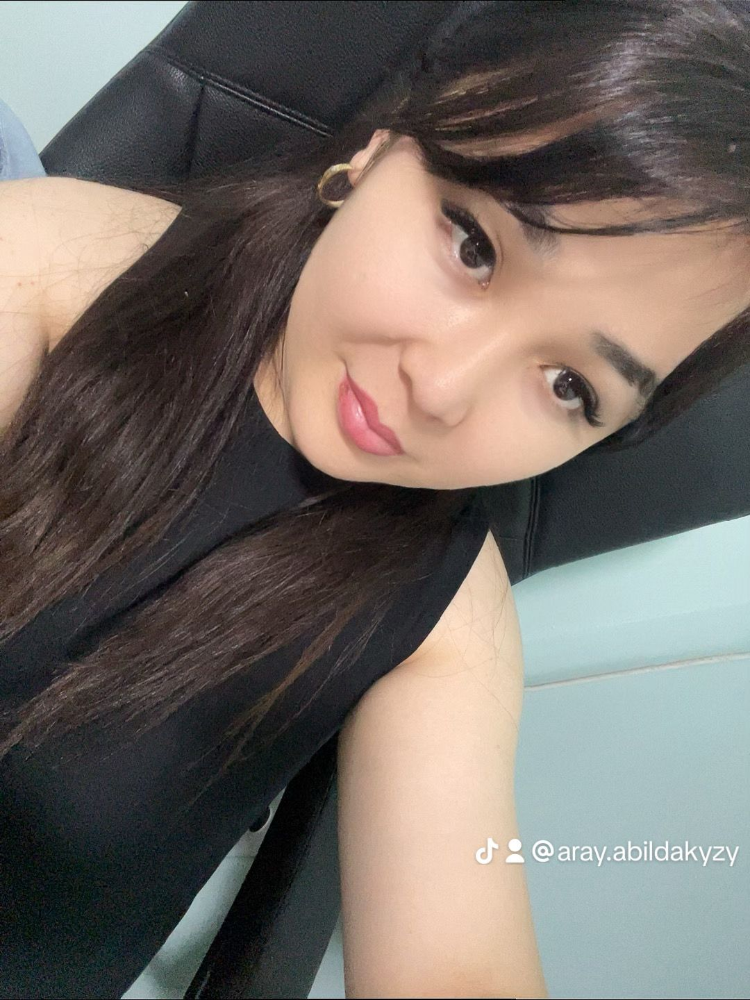
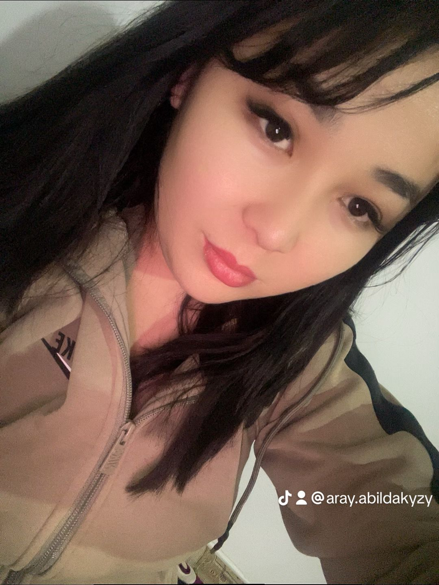
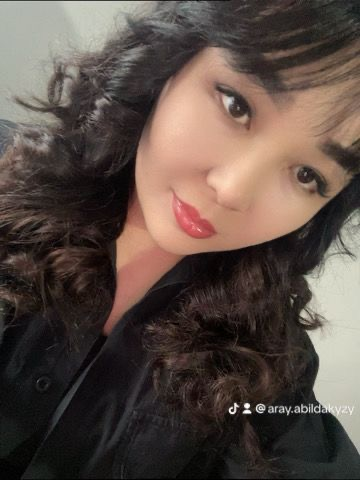

| 项目           | 信息                                                         |
| -------------- | ------------------------------------------------------------ |
| 编号           | Tang023                                                      |
| 姓名           | Sarsen Aray Abildakyzy                                       |
| 出生日期       | 1999年10月1日                                                |
| 年龄           | 25岁                                                         |
| 国籍           | 哈萨克斯坦                                                   |
| 现居住地       | 阿拉木图州，恩贝克什卡兹奥德，拜捷列克                       |
| 身高（厘米）   | 160                                                          |
| 体重（公斤）   | 75                                                           |
| 血型           | 3型阳性                                                      |
| 教育程度       | 高等医学院                                                   |
| 教育机构       |                                                              |
| 自我介绍       |                                                              |
| 性格           |                                                              |
| 爱好           |                                                              |
| 过敏           |                                                              |
| 眼睛颜色       | 哈萨克斯坦                                                   |
| 头发颜色       | 棕色                                                         |
| 是否喝酒       |                                                              |
| 是否吸烟       |                                                              |
| 上次月经第一天 | 14-20                                                        |
| 预计下次月经日期 |                                                             |
| 是否已婚       |                                                              |
| 先生同意捐卵吗 |                                                              |
| 是否处女       |                                                              |
| 可否住在公寓   |                                                              |
| 有兄弟姐妹吗   |                                                              |
| 慢性疾病       |                                                              |
| 做过手术吗     |                                                              |
| 参加过捐赠计划吗 |                                                             |
| 参加过多少次   |                                                              |
| 会说哪些语言   |                                                              |
| 何时准备加入捐款计划 |                                                         |
| 职业           | 护士                                                         |
| 子女数         | 2                                                            |
| 肤色           | 白皙                                                         |
| 脸型           |                                                              |
| 鼻型           |                                                              |
| 衣服尺码       | 48                                                           |
| 鞋码           | 37-38                                                        |
| 病史           | 无                                                           |
| AMH            |                                                              |
| 费用           | 50万起                                                       |

