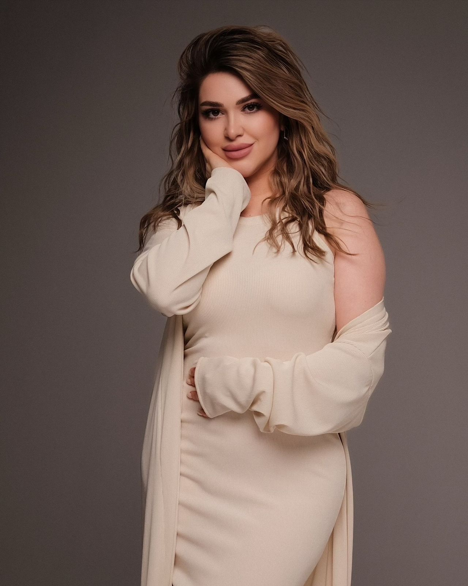
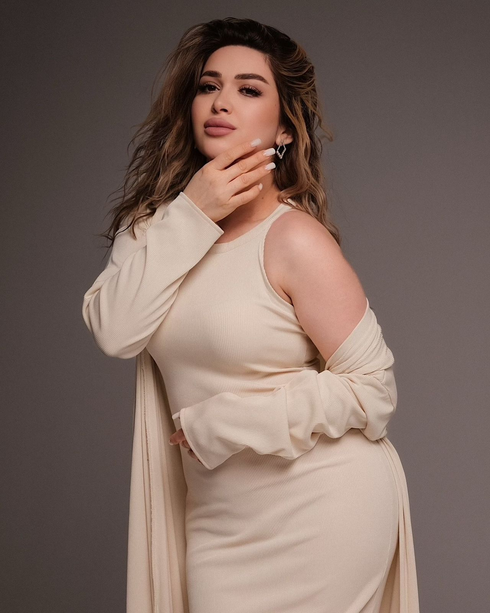
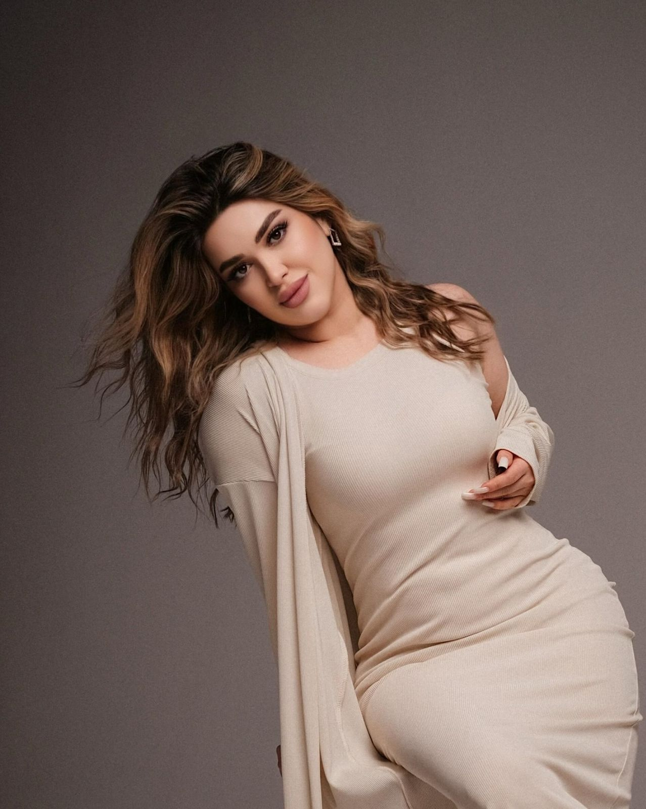
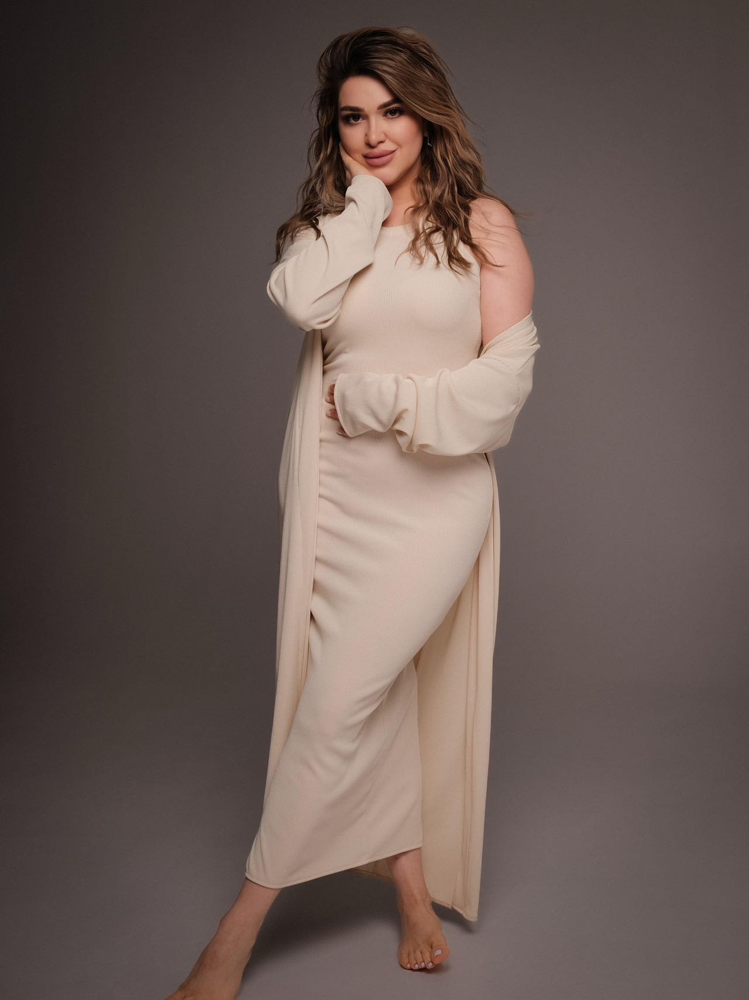
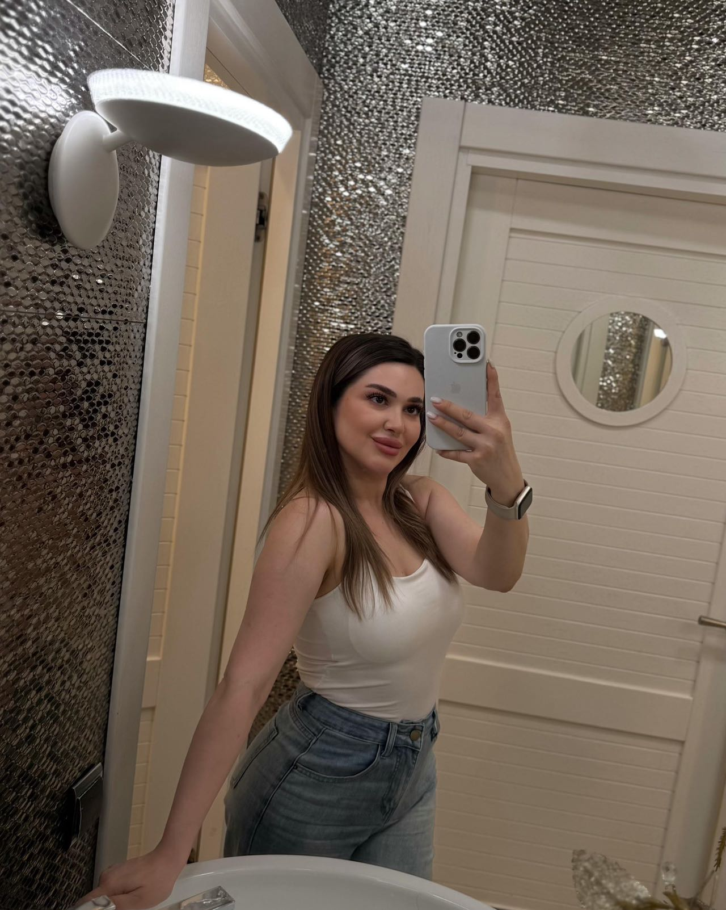
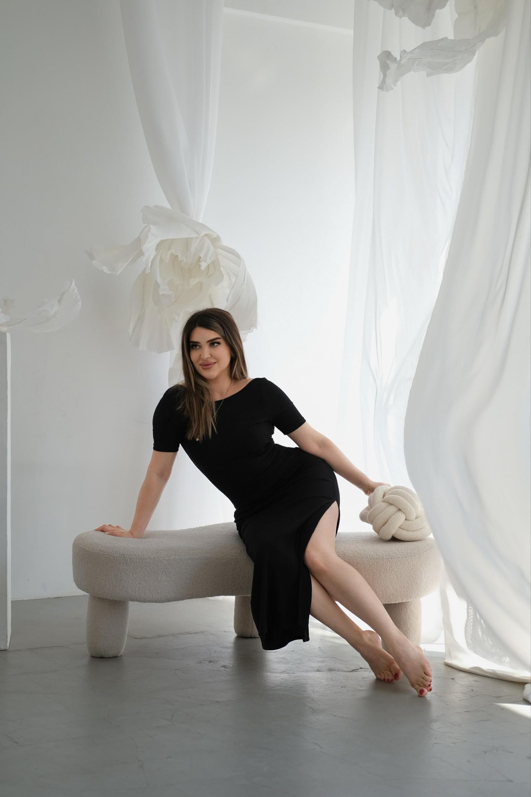

| 项目           | 信息                                                         |
| -------------- | ------------------------------------------------------------ |
| 编号           | Tang025                                                      |
| 姓名           | Shakirli Aysel                                               |
| 出生日期       | 1993年7月6日                                                 |
| 年龄           | 31                                                           |
| 国籍           | 阿塞拜疆                                                     |
| 现居住地       | 阿拉木图，博拉尔代                                           |
| 身高（厘米）   | 163                                                          |
| 体重（公斤）   | 61                                                           |
| 血型           | 3岁以上                                                      |
| 教育程度       | 中学专业                                                     |
| 教育机构       |                                                              |
| 自我介绍       |                                                              |
| 性格           |                                                              |
| 爱好           |                                                              |
| 过敏           |                                                              |
| 眼睛颜色       | 棕色                                                         |
| 头发颜色       | 深金色头发                                                   |
| 是否喝酒       |                                                              |
| 是否吸烟       |                                                              |
| 上次月经第一天 | 12.06月经后                                                  |
| 预计下次月经日期 |                                                             |
| 是否已婚       |                                                              |
| 先生同意捐卵吗 |                                                              |
| 是否处女       |                                                              |
| 可否住在公寓   |                                                              |
| 有兄弟姐妹吗   |                                                              |
| 慢性疾病       |                                                              |
| 做过手术吗     |                                                              |
| 参加过捐赠计划吗 | 在IRM诊所接受过2次捐赠                                      |
| 参加过多少次   |                                                              |
| 会说哪些语言   |                                                              |
| 何时准备加入捐款计划 |                                                         |
| 职业           | 教师，化妆师 - 眉毛师                                        |
| 子女数         | 2个孩子 - 男孩 (10.4)                                       |
| 肤色           | 浅色                                                         |
| 脸型           | 较圆的脸型                                                   |
| 鼻型           | 小鼻子                                                       |
| 衣服尺码       | S-M                                                          |
| 鞋码           | 37-38                                                        |
| 病史           | 从未生病                                                     |
| AMH            | —-                                                           |
| 费用           | 1,500,000-2,000,000                                          |

