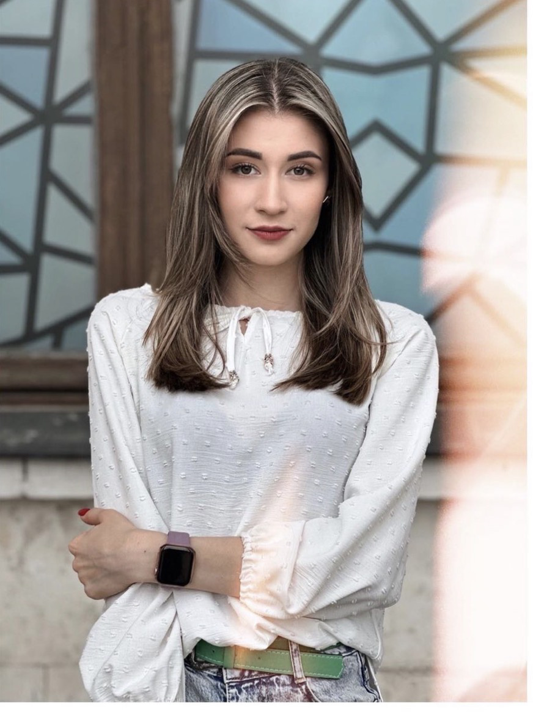
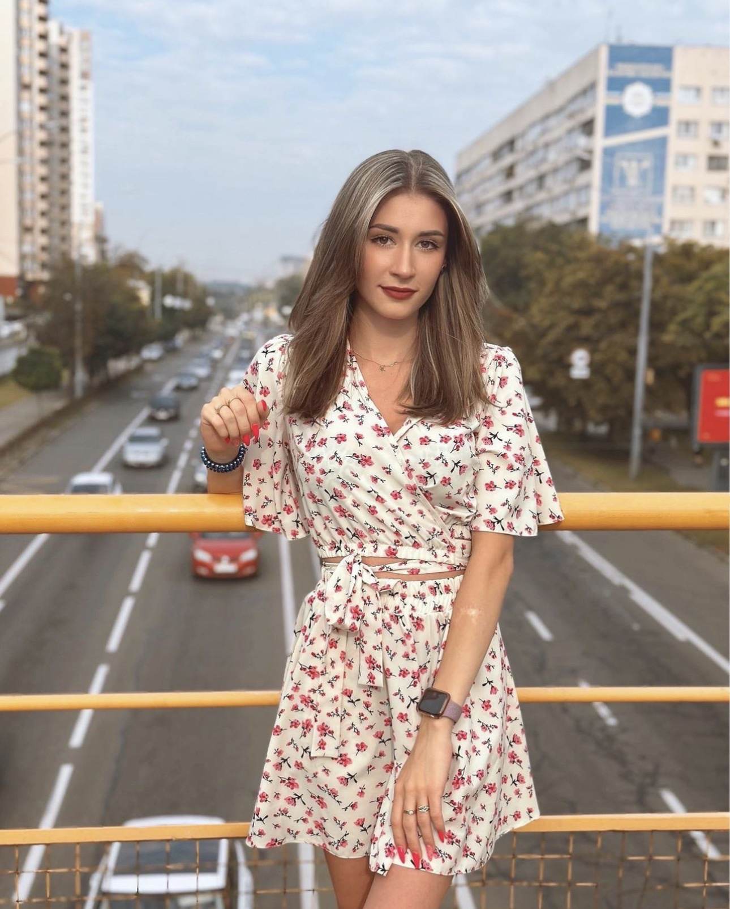

卵妹 **81** 号

| 项目 Item | 内容 Content |
|-----------|-------------|
| 出生日期 Date of Birth | 21.02.1998 |
| 年龄 Age | 25 |
| 国籍 Nation | Ukrainian |
| 教育 Education | 高等教育（研究生） |
| 专业 Profession | 音乐 |
| 毕业大学名 Graduated university | 利沃夫音乐学院 |
| 职业 Current job | 音乐视频博主 |
| 婚姻情况 Marital status | 已婚 |
| 捐过卵 Experience in oocyte donation | 0 次 |
| 几个卵子上次取过 How many eggs will you get | 21 个 |
| 身高 Height | 173cm |
| 体重 Weight | 51kg 公斤 |
| 头发颜色 Hair color | 黄色 / 棕色 |
| 眼睛颜色 Eye color | 棕色 |
| 血型 Blood type | B 型 |
| 下个月经周期 Cycle date | 08.01.2024 |
| 孩子 Children | 两个男孩（双胞胎）4 岁 |
| 哥弟姐妹 Number of siblings | 弟弟 妹妹 |
| 身体状况 Health status | healthy 健康 |
| 爱好 Hobbies | 唱歌 作曲 写作 |
| 体检结果 | amh 5 多卵泡储备 18 以上 |

