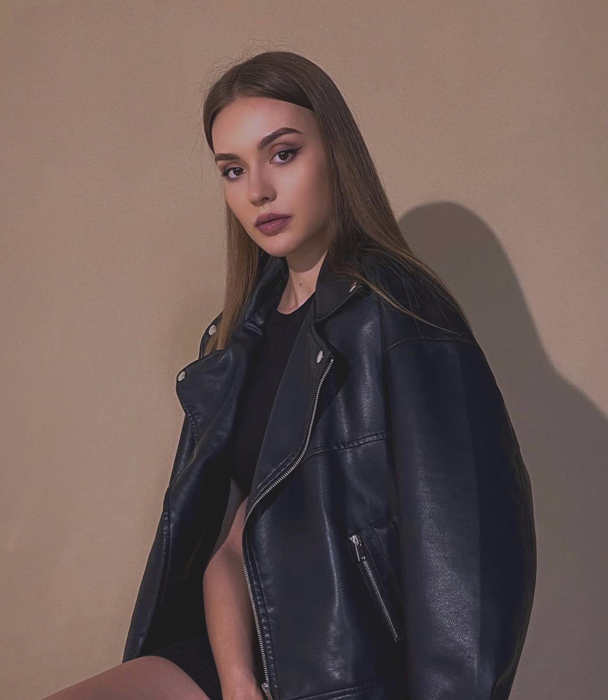

卵妹 **82** 号

| 项目 Item | 内容 Content |
|-----------|-------------|
| 出生日期 Date of Birth | 13.03.1999 |
| 年龄 Age | 24 |
| 国籍 Nation | Ukrainian |
| 教育 Education | 高等教育 |
| 专业 Profession | 体育训练 |
| 毕业大学名 Graduated university | 敖德萨国立体育大学 |
| 职业 Current job | 排球教练 |
| 婚姻情况 Marital status | 已婚 |
| 捐过卵 Experience in oocyte donation | - |
| 几个卵子上次取过 How many eggs will you get | - |
| 身高 Height | 177cm |
| 体重 Weight | 52kg 公斤 |
| 头发颜色 Hair color | 栗色 |
| 眼睛颜色 Eye color | 栗色 |
| 血型 Blood type | O 型 |
| 下个月经周期 Cycle date | 19.01.2024 |
| 孩子 Children | 一个女儿 2 岁 |
| 哥弟姐妹 Number of siblings | - |
| 身体状况 Health status | healthy 健康 |
| 爱好 Hobbies | 网球 排球 等体育运动 |
| 体检结果 | amh 8.4 多卵泡储备 20+ |

