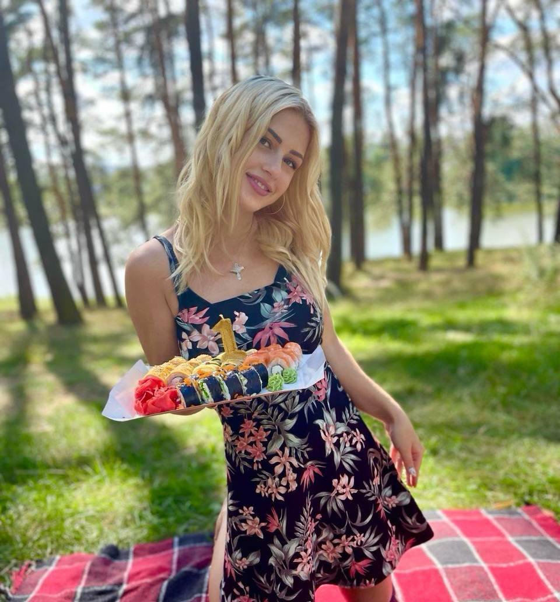
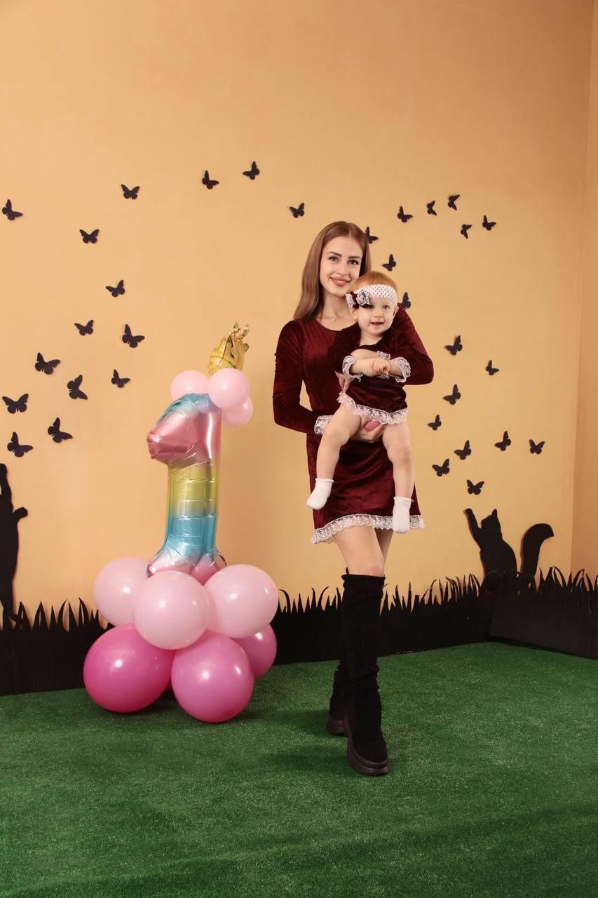
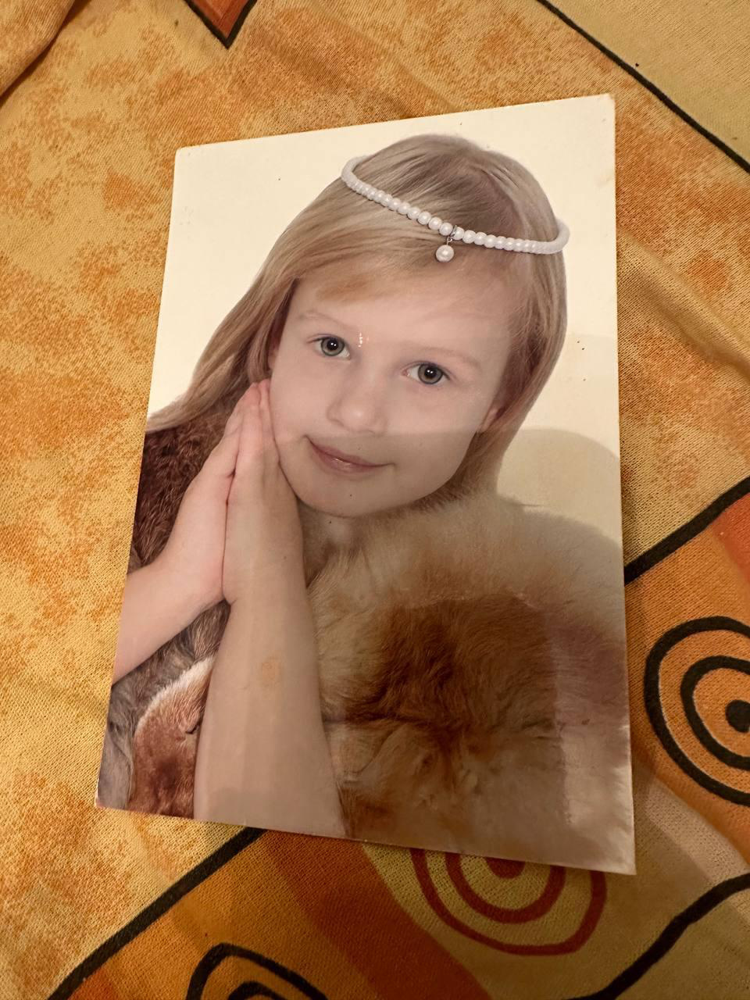

卵妹 **94** 号

| 项目 Item | 内容 Content |
|-----------|-------------|
| 出生日期 Date of Birth | 24.09.2001 |
| 年龄 Age | 23 |
| 国籍 Nation | 乌克兰 |
| 教育 Education | 高等学历 |
| 专业 Profession | 生物学家 |
| 毕业大学名 Graduated university | 基辅国立大学 |
| 职业 Current job | 暂时无职业 |
| 婚姻情况 Marital status | 结婚 |
| 捐过卵 Experience in oocyte donation | 无 |
| 几个卵子上次取过 How many eggs was you get | - |
| 身高 Height | 165 cm |
| 体重 Weight | 50 kg 公斤 |
| 头发颜色 Hair color | 浅褐色 |
| 眼睛颜色 Eye color | 褐色 |
| 血型 Blood type | 1+ O 阳性 |
| 下个月经周期 Cycle date | - |
| 孩子 Children | 有一个孩子 |
| 哥弟姐妹 Number of siblings | - |
| 身体状况 Health status | healthy 健康 |
| 爱好 Hobbies | 锻炼身体，画画儿 |
| 体检结果 | AMH 3.94 |

